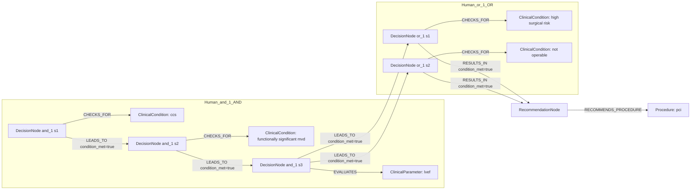
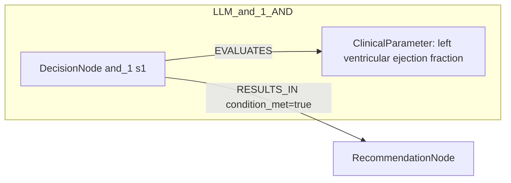

# row_11 (mapped to row_12)

Original table row text (ground truth):

```json
{
  "Recommendations": "In selected CCS patients with functionally significant MVD and LVEF \u2264 35% who are at high surgical risk or not operable, PCI may be considered as an alternative to CABG. 526,729",
  "Class a": "IIb",
  "Level b": "B"
}
```

Aligned JSON (expected vs actual):

<table>
  <tr>
    <th align="left">Human Annotation</th>
    <th align="left">LLM Generated</th>
  </tr>
  <tr>
    <td valign="top"><pre>
[
  {
    "conditions": [
      {
        "entity": "ccs",
        "entity_original": "ccs patient",
        "role": "ClinicalCondition",
        "operator": "PRESENT",
        "threshold": null,
        "unit": null,
        "context": null,
        "logic_type": "AND",
        "logic_group": "and_1",
        "strength": null,
        "level": null,
        "direction": null
      },
      {
        "entity": "high surgical risk",
        "entity_original": "patient with high surgical risk",
        "role": "ClinicalCondition",
        "operator": "PRESENT",
        "threshold": null,
        "unit": null,
        "context": null,
        "logic_type": "OR",
        "logic_group": "or_1",
        "strength": null,
        "level": null,
        "direction": null
      },
      {
        "entity": "not operable",
        "entity_original": "not operable patient",
        "role": "ClinicalCondition",
        "operator": "PRESENT",
        "threshold": null,
        "unit": null,
        "context": null,
        "logic_type": "OR",
        "logic_group": "or_1",
        "strength": null,
        "level": null,
        "direction": null
      },
      {
        "entity": "functionally significant mvd",
        "entity_original": "functionally significant mvd",
        "role": "ClinicalCondition",
        "operator": "PRESENT",
        "threshold": null,
        "unit": null,
        "context": null,
        "logic_type": "AND",
        "logic_group": "and_1",
        "strength": null,
        "level": null,
        "direction": null
      },
      {
        "entity": "lvef",
        "entity_original": "lvef \u2264 35%",
        "role": "ClinicalParameter",
        "operator": "\u2264",
        "threshold": "35",
        "unit": "%",
        "context": null,
        "logic_type": "AND",
        "logic_group": "and_1",
        "strength": null,
        "level": null,
        "direction": null
      }
    ],
    "actions": [
      {
        "entity": "pci",
        "entity_original": "pci may be considered as an alternative to cabg",
        "role": "Procedure",
        "operator": null,
        "threshold": null,
        "unit": null,
        "context": null,
        "logic_type": null,
        "logic_group": null,
        "strength": "IIb",
        "level": "B",
        "direction": "POSITIVE"
      }
    ]
  }
]
</pre></td>
    <td valign="top"><pre>
{
  "rules": [
    {
      "conditions": [
        {
          "entity": "left ventricular ejection fraction",
          "entity_original": "left ventricular ejection fraction \u2264 35%",
          "role": "ClinicalParameter",
          "operator": "<=",
          "threshold": "35",
          "unit": "%",
          "context": null,
          "logic_type": "AND",
          "logic_group": "and_1",
          "strength": "Class IIa",
          "level": "Level B",
          "direction": "POSITIVE"
        }
      ],
      "actions": []
    }
  ]
}
</pre></td>
  </tr>
</table>

Mermaid (Human Annotation):



Mermaid (LLM Generated):



Concepts:
- expected: 6
- actual: 1
- matches: 0
- missing: 6
- extra: 1

Missing concepts:
- ClinicalCondition: ccs
- ClinicalCondition: functionally significant mvd
- ClinicalCondition: high surgical risk
- ClinicalCondition: not operable
- ClinicalParameter: lvef
- Procedure: pci

Extra concepts:
- ClinicalParameter: left ventricular ejection fraction

Rules (concept + logic fields):
- expected: 6
- actual: 1
- matches: 0
- missing: 6
- extra: 1

Missing rules:
- ClinicalCondition: ccs | op=PRESENT | logic=AND | grp=and_1
- ClinicalCondition: functionally significant mvd | op=PRESENT | logic=AND | grp=and_1
- ClinicalCondition: high surgical risk | op=PRESENT | logic=OR | grp=or_1
- ClinicalCondition: not operable | op=PRESENT | logic=OR | grp=or_1
- ClinicalParameter: lvef | op=≤ | thr=35 | unit=% | logic=AND | grp=and_1
- Procedure: pci | class=IIb | level=B | dir=POSITIVE

Extra rules:
- ClinicalParameter: left ventricular ejection fraction | op=<= | thr=35 | unit=% | logic=AND | grp=and_1 | class=Class IIa | level=Level B | dir=POSITIVE
