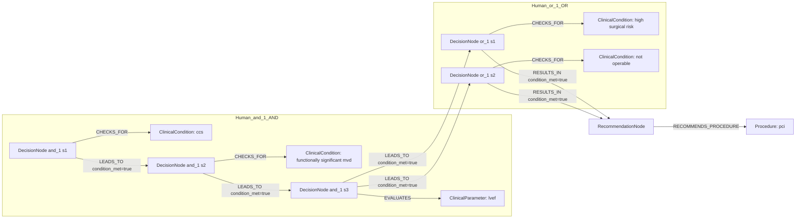
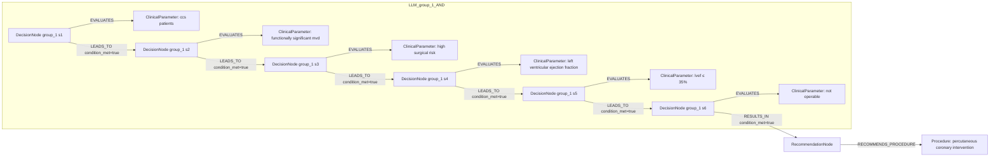

# row_11 (mapped to row_11)

Original table row text (ground truth):

```json
{
  "Recommendations": "In selected CCS patients with functionally significant MVD and LVEF \u2264 35% who are at high surgical risk or not operable, PCI may be considered as an alternative to CABG. 526,729",
  "Class a": "IIb",
  "Level b": "B"
}
```

Aligned JSON (expected vs actual):

<table>
  <tr>
    <th align="left">Human Annotation</th>
    <th align="left">LLM Generated</th>
  </tr>
  <tr>
    <td valign="top"><pre>
[
  {
    "conditions": [
      {
        "entity": "ccs",
        "entity_original": "ccs patient",
        "role": "ClinicalCondition",
        "operator": "PRESENT",
        "threshold": null,
        "unit": null,
        "context": null,
        "logic_type": "AND",
        "logic_group": "and_1",
        "strength": null,
        "level": null,
        "direction": null
      },
      {
        "entity": "high surgical risk",
        "entity_original": "patient with high surgical risk",
        "role": "ClinicalCondition",
        "operator": "PRESENT",
        "threshold": null,
        "unit": null,
        "context": null,
        "logic_type": "OR",
        "logic_group": "or_1",
        "strength": null,
        "level": null,
        "direction": null
      },
      {
        "entity": "not operable",
        "entity_original": "not operable patient",
        "role": "ClinicalCondition",
        "operator": "PRESENT",
        "threshold": null,
        "unit": null,
        "context": null,
        "logic_type": "OR",
        "logic_group": "or_1",
        "strength": null,
        "level": null,
        "direction": null
      },
      {
        "entity": "functionally significant mvd",
        "entity_original": "functionally significant mvd",
        "role": "ClinicalCondition",
        "operator": "PRESENT",
        "threshold": null,
        "unit": null,
        "context": null,
        "logic_type": "AND",
        "logic_group": "and_1",
        "strength": null,
        "level": null,
        "direction": null
      },
      {
        "entity": "lvef",
        "entity_original": "lvef \u2264 35%",
        "role": "ClinicalParameter",
        "operator": "\u2264",
        "threshold": "35",
        "unit": "%",
        "context": null,
        "logic_type": "AND",
        "logic_group": "and_1",
        "strength": null,
        "level": null,
        "direction": null
      }
    ],
    "actions": [
      {
        "entity": "pci",
        "entity_original": "pci may be considered as an alternative to cabg",
        "role": "Procedure",
        "operator": null,
        "threshold": null,
        "unit": null,
        "context": null,
        "logic_type": null,
        "logic_group": null,
        "strength": "IIb",
        "level": "B",
        "direction": "POSITIVE"
      }
    ]
  }
]
</pre></td>
    <td valign="top"><pre>
{
  "rules": [
    {
      "conditions": [
        {
          "entity": "left ventricular ejection fraction",
          "entity_original": "lvef",
          "role": "ClinicalParameter",
          "operator": "LE",
          "threshold": "35",
          "unit": "%",
          "context": null,
          "logic_type": null,
          "logic_group": null,
          "strength": null,
          "level": null,
          "direction": "POSITIVE",
          "preferred_term": "Left ventricular ejection fraction (observable entity)",
          "synonyms": [],
          "snomed_id": 250908004,
          "target_label": "ClinicalParameter",
          "taxonomy_path": [
            {
              "concept_id": "250908004",
              "term": "Left ventricular ejection fraction (observable entity)"
            },
            {
              "concept_id": "70822001",
              "term": "Cardiac ejection fraction, function (observable entity)"
            },
            {
              "concept_id": "86185002",
              "term": "Cardiac function (observable entity)"
            },
            {
              "concept_id": "70337006",
              "term": "Cardiovascular function (observable entity)"
            },
            {
              "concept_id": "246464006",
              "term": "Function (observable entity)"
            },
            {
              "concept_id": "363787002",
              "term": "Observable entity (observable entity)"
            }
          ],
          "root_concept_id": "363787002",
          "root_concept_term": "Observable entity (observable entity)"
        },
        {
          "entity": "lvef \u2264 35%",
          "entity_original": "lvef \u2264 35%",
          "role": "ClinicalParameter",
          "operator": "\u2264",
          "threshold": "35",
          "unit": "%",
          "context": null,
          "logic_type": null,
          "logic_group": null,
          "strength": null,
          "level": null,
          "direction": "UNKNOWN",
          "preferred_term": "Left ventricular ejection fraction (observable entity)",
          "synonyms": [
            "Left ventricular ejection fraction",
            "LVEF - Left ventricular ejection fraction"
          ],
          "snomed_id": 250908004,
          "target_label": "ClinicalParameter",
          "taxonomy_path": [
            {
              "concept_id": "250908004",
              "term": "Left ventricular ejection fraction (observable entity)"
            },
            {
              "concept_id": "250907009",
              "term": "Left ventricular function (observable entity)"
            },
            {
              "concept_id": "364080001",
              "term": "Feature of left ventricle (observable entity)"
            },
            {
              "concept_id": "364072008",
              "term": "Cardiac feature (observable entity)"
            },
            {
              "concept_id": "414236006",
              "term": "Feature of anatomical entity (observable entity)"
            },
            {
              "concept_id": "414237002",
              "term": "Feature of entity (observable entity)"
            },
            {
              "concept_id": "363787002",
              "term": "Observable entity (observable entity)"
            },
            {
              "concept_id": "138875005",
              "term": "SNOMED CT Concept (SNOMED RT+CTV3)"
            }
          ],
          "root_concept_id": "363787002",
          "root_concept_term": "Observable entity (observable entity)"
        }
      ],
      "actions": [
        {
          "entity": "percutaneous coronary intervention",
          "entity_original": "pci",
          "role": "Procedure",
          "operator": null,
          "threshold": null,
          "unit": null,
          "context": null,
          "logic_type": null,
          "logic_group": null,
          "strength": "Class IIb",
          "level": "B",
          "direction": "POSITIVE",
          "preferred_term": "Percutaneous transluminal coronary intervention using imaging guidance with contrast (procedure)",
          "synonyms": [],
          "snomed_id": 415070008,
          "target_label": "Procedure",
          "taxonomy_path": [
            {
              "concept_id": "415070008",
              "term": "Percutaneous transluminal coronary intervention using imaging guidance with contrast (procedure)"
            },
            {
              "concept_id": "4365001",
              "term": "Surgical repair (procedure)"
            },
            {
              "concept_id": "128927009",
              "term": "Procedure by method (procedure)"
            },
            {
              "concept_id": "71388002",
              "term": "Procedure (procedure)"
            }
          ],
          "root_concept_id": "71388002",
          "root_concept_term": "Procedure (procedure)"
        }
      ]
    }
  ]
}
</pre></td>
  </tr>
</table>

Mermaid (Human Annotation):



Mermaid (LLM Generated):



Grounding summary (optional):

```json
{
  "enabled": true,
  "total_grounded": 3,
  "target_label_counts": {
    "ClinicalParameter": 2,
    "Procedure": 1
  },
  "root_hit_counts": {
    "363787002": 2,
    "71388002": 1
  },
  "root_hits": [
    {
      "entity": "left ventricular ejection fraction",
      "entity_original": "LVEF",
      "role": "ClinicalParameter",
      "preferred_term": "Left ventricular ejection fraction (observable entity)",
      "synonyms": [],
      "snomed_id": 250908004,
      "target_label": "ClinicalParameter",
      "taxonomy_path": [
        {
          "concept_id": "250908004",
          "term": "Left ventricular ejection fraction (observable entity)"
        },
        {
          "concept_id": "70822001",
          "term": "Cardiac ejection fraction, function (observable entity)"
        },
        {
          "concept_id": "86185002",
          "term": "Cardiac function (observable entity)"
        },
        {
          "concept_id": "70337006",
          "term": "Cardiovascular function (observable entity)"
        },
        {
          "concept_id": "246464006",
          "term": "Function (observable entity)"
        },
        {
          "concept_id": "363787002",
          "term": "Observable entity (observable entity)"
        }
      ],
      "root_hit": {
        "root_concept_id": "363787002",
        "root_concept_term": "Observable entity (observable entity)",
        "mapped_target_label": "ClinicalParameter"
      }
    },
    {
      "entity": "percutaneous coronary intervention",
      "entity_original": "PCI",
      "role": "Procedure",
      "preferred_term": "Percutaneous transluminal coronary intervention using imaging guidance with contrast (procedure)",
      "synonyms": [],
      "snomed_id": 415070008,
      "target_label": "Procedure",
      "taxonomy_path": [
        {
          "concept_id": "415070008",
          "term": "Percutaneous transluminal coronary intervention using imaging guidance with contrast (procedure)"
        },
        {
          "concept_id": "4365001",
          "term": "Surgical repair (procedure)"
        },
        {
          "concept_id": "128927009",
          "term": "Procedure by method (procedure)"
        },
        {
          "concept_id": "71388002",
          "term": "Procedure (procedure)"
        }
      ],
      "root_hit": {
        "root_concept_id": "71388002",
        "root_concept_term": "Procedure (procedure)",
        "mapped_target_label": "Procedure"
      }
    },
    {
      "entity": "LVEF \u2264 35%",
      "entity_original": "LVEF \u2264 35%",
      "role": "ClinicalParameter",
      "preferred_term": "Left ventricular ejection fraction (observable entity)",
      "synonyms": [
        "Left ventricular ejection fraction",
        "LVEF - Left ventricular ejection fraction"
      ],
      "snomed_id": 250908004,
      "target_label": "ClinicalParameter",
      "taxonomy_path": [
        {
          "concept_id": "250908004",
          "term": "Left ventricular ejection fraction (observable entity)"
        },
        {
          "concept_id": "250907009",
          "term": "Left ventricular function (observable entity)"
        },
        {
          "concept_id": "364080001",
          "term": "Feature of left ventricle (observable entity)"
        },
        {
          "concept_id": "364072008",
          "term": "Cardiac feature (observable entity)"
        },
        {
          "concept_id": "414236006",
          "term": "Feature of anatomical entity (observable entity)"
        },
        {
          "concept_id": "414237002",
          "term": "Feature of entity (observable entity)"
        },
        {
          "concept_id": "363787002",
          "term": "Observable entity (observable entity)"
        },
        {
          "concept_id": "138875005",
          "term": "SNOMED CT Concept (SNOMED RT+CTV3)"
        }
      ],
      "root_hit": {
        "root_concept_id": "363787002",
        "root_concept_term": "Observable entity (observable entity)",
        "mapped_target_label": "ClinicalParameter"
      }
    }
  ]
}
```

Concepts:
- expected: 6
- actual: 7
- matches: 0
- missing: 6
- extra: 7

Missing concepts:
- ClinicalCondition: ccs
- ClinicalCondition: functionally significant mvd
- ClinicalCondition: high surgical risk
- ClinicalCondition: not operable
- ClinicalParameter: lvef
- Procedure: pci

Extra concepts:
- ClinicalParameter: ccs patients
- ClinicalParameter: functionally significant mvd
- ClinicalParameter: high surgical risk
- ClinicalParameter: left ventricular ejection fraction
- ClinicalParameter: lvef ≤ 35%
- ClinicalParameter: not operable
- Procedure: percutaneous coronary intervention

Rules (concept + logic fields):
- expected: 6
- actual: 7
- matches: 0
- missing: 6
- extra: 7

Missing rules:
- ClinicalCondition: ccs | op=PRESENT | logic=AND | grp=and_1
- ClinicalCondition: functionally significant mvd | op=PRESENT | logic=AND | grp=and_1
- ClinicalCondition: high surgical risk | op=PRESENT | logic=OR | grp=or_1
- ClinicalCondition: not operable | op=PRESENT | logic=OR | grp=or_1
- ClinicalParameter: lvef | op=≤ | thr=35 | unit=% | logic=AND | grp=and_1
- Procedure: pci | class=IIb | level=B | dir=POSITIVE

Extra rules:
- ClinicalParameter: ccs patients | op=PRESENT | dir=UNKNOWN
- ClinicalParameter: functionally significant mvd | op=PRESENT | dir=POSITIVE
- ClinicalParameter: high surgical risk | op=PRESENT | dir=UNKNOWN
- ClinicalParameter: left ventricular ejection fraction | op=LE | thr=35 | unit=% | dir=POSITIVE
- ClinicalParameter: lvef ≤ 35% | op=≤ | thr=35 | unit=% | dir=UNKNOWN
- ClinicalParameter: not operable | op=PRESENT | dir=UNKNOWN
- Procedure: percutaneous coronary intervention | class=Class IIb | level=B | dir=POSITIVE

