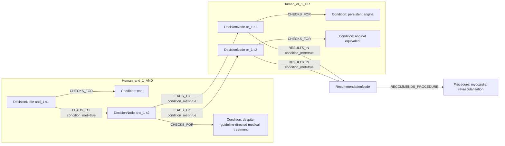
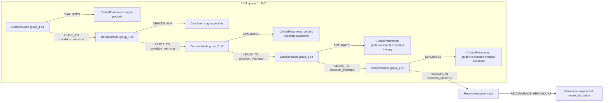

# row_12 (mapped to row_12)

Original table row text (ground truth):

```json
{
  "Recommendations": "In CCS patients with persistent angina or anginal equivalent, despite guideline-directed medical treatment, myocardial revascularization of functionally significant obstructive CAD is recommended to improve symptoms. 50,321,402,732,734,757",
  "Class a": "I",
  "Level b": "A"
}
```

Aligned JSON (expected vs actual):

<table>
  <tr>
    <th align="left">Human Annotation</th>
    <th align="left">LLM Generated</th>
  </tr>
  <tr>
    <td valign="top"><pre>
[
  {
    "rule_id": 1,
    "conditions": [
      {
        "entity": "ccs",
        "entity_original": "ccs patient",
        "role": "Condition",
        "operator": "PRESENT",
        "threshold": null,
        "unit": null,
        "condition_context": null,
        "logic_type": "AND",
        "logic_group": "and_1",
        "strength": null,
        "level": null,
        "direction": null
      },
      {
        "entity": "persistent angina",
        "entity_original": "persistent angina",
        "role": "Condition",
        "operator": "PRESENT",
        "threshold": null,
        "unit": null,
        "condition_context": null,
        "logic_type": "OR",
        "logic_group": "or_1",
        "strength": null,
        "level": null,
        "direction": null
      },
      {
        "entity": "anginal equivalent",
        "entity_original": "anginal equivalent",
        "role": "Condition",
        "operator": "PRESENT",
        "threshold": null,
        "unit": null,
        "condition_context": null,
        "logic_type": "OR",
        "logic_group": "or_1",
        "strength": null,
        "level": null,
        "direction": null
      },
      {
        "entity": "despite guideline-directed medical treatment",
        "entity_original": "despite guideline-directed medical treatment",
        "role": "Condition",
        "operator": "PRESENT",
        "threshold": null,
        "unit": null,
        "condition_context": null,
        "logic_type": "AND",
        "logic_group": "and_1",
        "strength": null,
        "level": null,
        "direction": null
      }
    ],
    "actions": [
      {
        "entity": "myocardial revascularization",
        "entity_original": "myocardial revascularization of functionally significant obstructive cad is recommended to improve symptoms",
        "role": "Procedure",
        "operator": null,
        "threshold": null,
        "unit": null,
        "condition_context": null,
        "logic_type": null,
        "logic_group": null,
        "strength": "I",
        "level": "A",
        "direction": "POSITIVE"
      }
    ]
  }
]
</pre></td>
    <td valign="top"><pre>
{
  "1": {
    "conditions": [
      {
        "entity": "angina pectoris",
        "entity_original": "persistent angina or anginal equivalent",
        "role": "Condition",
        "operator": "PRESENT",
        "threshold": null,
        "unit": null,
        "condition_context": "persistent",
        "logic_type": null,
        "logic_group": null,
        "strength": "I",
        "level": "A",
        "direction": "POSITIVE",
        "rule_id": 1,
        "side": "condition",
        "preferred_term": "Angina pectoris (disorder)",
        "synonyms": [],
        "snomed_id": 17828002,
        "target_label": "ClinicalCondition",
        "taxonomy_path": [
          {
            "concept_id": "17828002",
            "term": "Angina pectoris (disorder)"
          }
        ],
        "root_concept_id": null,
        "root_concept_term": null,
        "mapped_target_label": null
      },
      {
        "entity": "angina pectoris",
        "entity_original": "persistent angina or anginal equivalent",
        "role": "ClinicalParameter",
        "operator": "PRESENT",
        "threshold": null,
        "unit": null,
        "condition_context": "persistent",
        "logic_type": null,
        "logic_group": null,
        "strength": "I",
        "level": "A",
        "direction": "UNKNOWN",
        "rule_id": 1,
        "side": "condition",
        "preferred_term": "Angina pectoris (disorder)",
        "synonyms": [],
        "snomed_id": 17828002,
        "target_label": "ClinicalCondition",
        "taxonomy_path": [
          {
            "concept_id": "17828002",
            "term": "Angina pectoris (disorder)"
          }
        ],
        "root_concept_id": null,
        "root_concept_term": null,
        "mapped_target_label": null
      }
    ],
    "actions": [
      {
        "entity": "myocardial revascularization",
        "entity_original": "myocardial revascularization of functionally significant obstructive cad",
        "role": "Procedure",
        "operator": "PRESENT",
        "threshold": null,
        "unit": null,
        "condition_context": null,
        "logic_type": null,
        "logic_group": null,
        "strength": "I",
        "level": "A",
        "direction": "POSITIVE",
        "rule_id": 1,
        "side": "action",
        "preferred_term": "Myocardial revascularization (procedure)",
        "synonyms": [],
        "snomed_id": 275227003,
        "target_label": "Procedure",
        "taxonomy_path": [
          {
            "concept_id": "275227003",
            "term": "Myocardial revascularization (procedure)"
          },
          {
            "concept_id": "81266008",
            "term": "Heart revascularization (procedure)"
          },
          {
            "concept_id": "31413008",
            "term": "Operative procedure on coronary artery (procedure)"
          },
          {
            "concept_id": "38629001",
            "term": "Operative procedure on the arteries of the thorax and abdomen (procedure)"
          },
          {
            "concept_id": "74943008",
            "term": "Operation on trunk (procedure)"
          },
          {
            "concept_id": "387713003",
            "term": "Surgical procedure (procedure)"
          },
          {
            "concept_id": "71388002",
            "term": "Procedure (procedure)"
          }
        ],
        "root_concept_id": "71388002",
        "root_concept_term": "Procedure (procedure)",
        "mapped_target_label": "Procedure"
      }
    ]
  }
}
</pre></td>
  </tr>
</table>

Mermaid (Human Annotation):



Mermaid (LLM Generated):



Grounding summary (optional):

```json
{
  "enabled": true,
  "total_grounded": 3,
  "target_label_counts": {
    "ClinicalCondition": 2,
    "Procedure": 1
  },
  "root_hit_counts": {
    "71388002": 1
  },
  "root_hits": [
    {
      "entity": "Angina Pectoris",
      "entity_original": "persistent angina or anginal equivalent",
      "role": "Condition",
      "preferred_term": "Angina pectoris (disorder)",
      "synonyms": [],
      "snomed_id": 17828002,
      "target_label": "ClinicalCondition",
      "taxonomy_path": [
        {
          "concept_id": "17828002",
          "term": "Angina pectoris (disorder)"
        }
      ],
      "root_hit": null
    },
    {
      "entity": "Myocardial Revascularization",
      "entity_original": "myocardial revascularization of functionally significant obstructive CAD",
      "role": "Procedure",
      "preferred_term": "Myocardial revascularization (procedure)",
      "synonyms": [],
      "snomed_id": 275227003,
      "target_label": "Procedure",
      "taxonomy_path": [
        {
          "concept_id": "275227003",
          "term": "Myocardial revascularization (procedure)"
        },
        {
          "concept_id": "81266008",
          "term": "Heart revascularization (procedure)"
        },
        {
          "concept_id": "31413008",
          "term": "Operative procedure on coronary artery (procedure)"
        },
        {
          "concept_id": "38629001",
          "term": "Operative procedure on the arteries of the thorax and abdomen (procedure)"
        },
        {
          "concept_id": "74943008",
          "term": "Operation on trunk (procedure)"
        },
        {
          "concept_id": "387713003",
          "term": "Surgical procedure (procedure)"
        },
        {
          "concept_id": "71388002",
          "term": "Procedure (procedure)"
        }
      ],
      "root_hit": {
        "root_concept_id": "71388002",
        "root_concept_term": "Procedure (procedure)",
        "mapped_target_label": "Procedure"
      }
    },
    {
      "entity": "Angina pectoris",
      "entity_original": "persistent angina or anginal equivalent",
      "role": "ClinicalParameter",
      "preferred_term": "Angina pectoris (disorder)",
      "synonyms": [],
      "snomed_id": 17828002,
      "target_label": "ClinicalCondition",
      "taxonomy_path": [
        {
          "concept_id": "17828002",
          "term": "Angina pectoris (disorder)"
        }
      ],
      "root_hit": null
    }
  ]
}
```

Concepts:
- expected: 5
- actual: 6
- matches: 1
- missing: 4
- extra: 5

Missing concepts:
- Condition: anginal equivalent
- Condition: ccs
- Condition: despite guideline-directed medical treatment
- Condition: persistent angina

Extra concepts:
- ClinicalParameter: angina pectoris
- ClinicalParameter: chronic coronary syndrome
- ClinicalParameter: guideline-directed medical therapy
- ClinicalParameter: guideline-directed medical treatment
- Condition: angina pectoris

Rules (concept + logic fields):
- expected: 5
- actual: 6
- matches: 0
- missing: 5
- extra: 6

Missing rules:
- Condition: anginal equivalent | op=PRESENT | logic=OR | grp=or_1
- Condition: ccs | op=PRESENT | logic=AND | grp=and_1
- Condition: despite guideline-directed medical treatment | op=PRESENT | logic=AND | grp=and_1
- Condition: persistent angina | op=PRESENT | logic=OR | grp=or_1
- Procedure: myocardial revascularization | class=I | level=A | dir=POSITIVE

Extra rules:
- ClinicalParameter: angina pectoris | op=PRESENT | ctx=persistent | class=I | level=A | dir=UNKNOWN
- ClinicalParameter: chronic coronary syndrome | op=PRESENT | class=I | level=A | dir=POSITIVE
- ClinicalParameter: guideline-directed medical therapy | op=PRESENT | class=I | level=A | dir=UNKNOWN
- ClinicalParameter: guideline-directed medical treatment | op=PRESENT | class=I | level=A | dir=POSITIVE
- Condition: angina pectoris | op=PRESENT | ctx=persistent | class=I | level=A | dir=POSITIVE
- Procedure: myocardial revascularization | op=PRESENT | class=I | level=A | dir=POSITIVE

