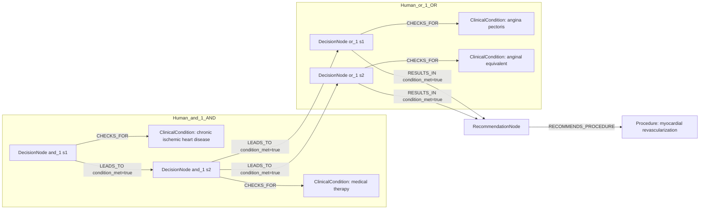

# row_12 (mapped to row_13)

Original table row text (ground truth):

```json
{
  "Recommendations": "In CCS patients with persistent angina or anginal equivalent, despite guideline-directed medical treatment, myocardial revascularization of functionally significant obstructive CAD is recommended to improve symptoms. 50,321,402,732,734,757",
  "Class a": "I",
  "Level b": "A"
}
```

Aligned JSON (expected vs actual):

<table>
  <tr>
    <th align="left">Human Annotation</th>
    <th align="left">LLM Generated</th>
  </tr>
  <tr>
    <td valign="top"><pre>
[
  {
    "conditions": [
      {
        "entity": "chronic ischemic heart disease",
        "entity_original": "ccs patient",
        "role": "ClinicalCondition",
        "operator": "PRESENT",
        "threshold": null,
        "unit": null,
        "context": null,
        "logic_type": "AND",
        "logic_group": "and_1",
        "strength": null,
        "level": null,
        "direction": null
      },
      {
        "entity": "angina pectoris",
        "entity_original": "persistent angina",
        "role": "ClinicalCondition",
        "operator": "PRESENT",
        "threshold": null,
        "unit": null,
        "context": null,
        "logic_type": "OR",
        "logic_group": "or_1",
        "strength": null,
        "level": null,
        "direction": null
      },
      {
        "entity": "anginal equivalent",
        "entity_original": "anginal equivalent",
        "role": "ClinicalCondition",
        "operator": "PRESENT",
        "threshold": null,
        "unit": null,
        "context": null,
        "logic_type": "OR",
        "logic_group": "or_1",
        "strength": null,
        "level": null,
        "direction": null
      },
      {
        "entity": "medical therapy",
        "entity_original": "despite guideline-directed medical treatment",
        "role": "ClinicalCondition",
        "operator": "PRESENT",
        "threshold": null,
        "unit": null,
        "context": null,
        "logic_type": "AND",
        "logic_group": "and_1",
        "strength": null,
        "level": null,
        "direction": null
      }
    ],
    "actions": [
      {
        "entity": "myocardial revascularization",
        "entity_original": "myocardial revascularization of functionally significant obstructive cad is recommended to improve symptoms",
        "role": "Procedure",
        "operator": null,
        "threshold": null,
        "unit": null,
        "context": null,
        "logic_type": null,
        "logic_group": null,
        "strength": "I",
        "level": "A",
        "direction": "POSITIVE"
      }
    ]
  }
]
</pre></td>
    <td valign="top"><pre>
{
  "rules": [
    {
      "conditions": [],
      "actions": []
    }
  ]
}
</pre></td>
  </tr>
</table>

Mermaid (Human Annotation):



Mermaid (LLM Generated):


Concepts:
- expected: 5
- actual: 4
- matches: 0
- missing: 5
- extra: 4

Missing concepts:
- ClinicalCondition: angina pectoris
- ClinicalCondition: anginal equivalent
- ClinicalCondition: chronic ischemic heart disease
- ClinicalCondition: medical therapy
- Procedure: myocardial revascularization

Extra concepts:
- ClinicalParameter: left ventricular ejection fraction
- Condition: chronic coronary syndrome with left ventricular ejection fraction
- Procedure: medical therapy
- Procedure: revascularization

Rules (concept + logic fields):
- expected: 5
- actual: 4
- matches: 0
- missing: 5
- extra: 4

Missing rules:
- ClinicalCondition: angina pectoris | op=PRESENT | logic=OR | grp=or_1
- ClinicalCondition: anginal equivalent | op=PRESENT | logic=OR | grp=or_1
- ClinicalCondition: chronic ischemic heart disease | op=PRESENT | logic=AND | grp=and_1
- ClinicalCondition: medical therapy | op=PRESENT | logic=AND | grp=and_1
- Procedure: myocardial revascularization | class=I | level=A | dir=POSITIVE

Extra rules:
- ClinicalParameter: left ventricular ejection fraction | op=<= | thr=35 | unit=% | logic=AND | grp=and_1 | class=Class I | level=C | dir=POSITIVE
- Condition: chronic coronary syndrome with left ventricular ejection fraction | op=<= | thr=35 | unit=% | logic=AND | grp=and_1 | class=Class I | level=C | dir=POSITIVE
- Procedure: medical therapy | class=Class I | level=C | dir=POSITIVE
- Procedure: revascularization | class=Class I | level=C | dir=POSITIVE

