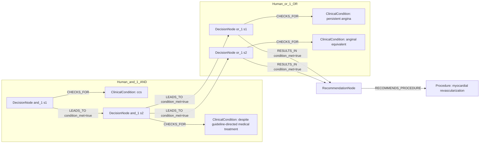
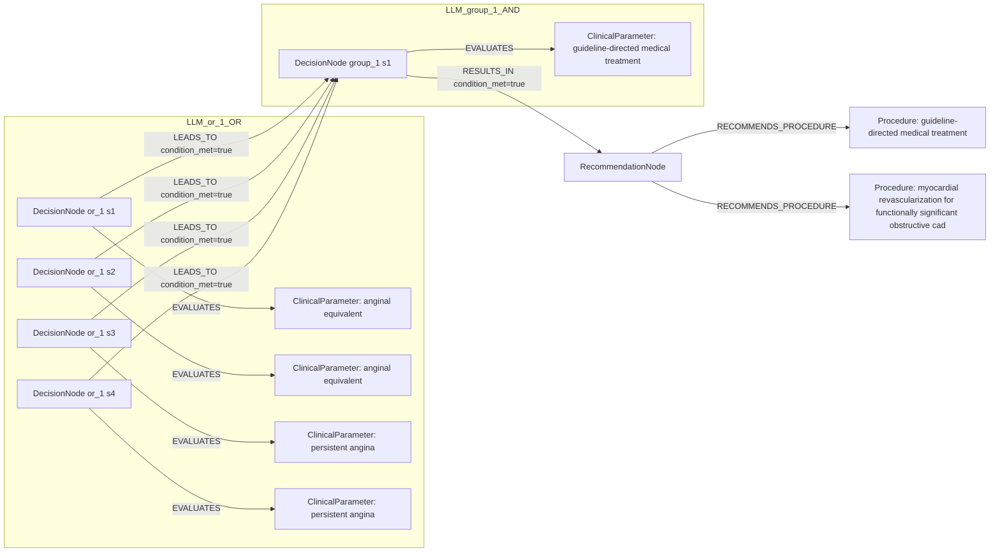

# row_12 (mapped to row_12)

Original table row text (ground truth):

```json
{
  "Recommendations": "In CCS patients with persistent angina or anginal equivalent, despite guideline-directed medical treatment, myocardial revascularization of functionally significant obstructive CAD is recommended to improve symptoms. 50,321,402,732,734,757",
  "Class a": "I",
  "Level b": "A"
}
```

Aligned JSON (expected vs actual):

<table>
  <tr>
    <th align="left">Human Annotation</th>
    <th align="left">LLM Generated</th>
  </tr>
  <tr>
    <td valign="top"><pre>
[
  {
    "conditions": [
      {
        "entity": "ccs",
        "entity_original": "ccs patient",
        "role": "ClinicalCondition",
        "operator": "PRESENT",
        "threshold": null,
        "unit": null,
        "context": null,
        "logic_type": "AND",
        "logic_group": "and_1",
        "strength": null,
        "level": null,
        "direction": null
      },
      {
        "entity": "persistent angina",
        "entity_original": "persistent angina",
        "role": "ClinicalCondition",
        "operator": "PRESENT",
        "threshold": null,
        "unit": null,
        "context": null,
        "logic_type": "OR",
        "logic_group": "or_1",
        "strength": null,
        "level": null,
        "direction": null
      },
      {
        "entity": "anginal equivalent",
        "entity_original": "anginal equivalent",
        "role": "ClinicalCondition",
        "operator": "PRESENT",
        "threshold": null,
        "unit": null,
        "context": null,
        "logic_type": "OR",
        "logic_group": "or_1",
        "strength": null,
        "level": null,
        "direction": null
      },
      {
        "entity": "despite guideline-directed medical treatment",
        "entity_original": "despite guideline-directed medical treatment",
        "role": "ClinicalCondition",
        "operator": "PRESENT",
        "threshold": null,
        "unit": null,
        "context": null,
        "logic_type": "AND",
        "logic_group": "and_1",
        "strength": null,
        "level": null,
        "direction": null
      }
    ],
    "actions": [
      {
        "entity": "myocardial revascularization",
        "entity_original": "myocardial revascularization of functionally significant obstructive cad is recommended to improve symptoms",
        "role": "Procedure",
        "operator": null,
        "threshold": null,
        "unit": null,
        "context": null,
        "logic_type": null,
        "logic_group": null,
        "strength": "I",
        "level": "A",
        "direction": "POSITIVE"
      }
    ]
  }
]
</pre></td>
    <td valign="top"><pre>
{
  "rules": [
    {
      "conditions": [
        {
          "entity": "anginal equivalent",
          "entity_original": "persistent angina or anginal equivalent",
          "role": "ClinicalParameter",
          "operator": "PRESENT",
          "threshold": null,
          "unit": null,
          "context": null,
          "logic_type": "OR",
          "logic_group": "or_1",
          "strength": "Class I",
          "level": "A",
          "direction": "POSITIVE",
          "preferred_term": "Metabolic equivalent of task (observable entity)",
          "synonyms": [
            "Metabolic equivalent of task",
            "MET - metabolic equivalent of task"
          ],
          "snomed_id": 698834005,
          "target_label": "ClinicalParameter",
          "taxonomy_path": [
            {
              "concept_id": "698834005",
              "term": "Metabolic equivalent of task (observable entity)"
            },
            {
              "concept_id": "364392006",
              "term": "Metabolic observable (observable entity)"
            },
            {
              "concept_id": "363788007",
              "term": "Clinical history/examination observable (observable entity)"
            },
            {
              "concept_id": "363787002",
              "term": "Observable entity (observable entity)"
            },
            {
              "concept_id": "138875005",
              "term": "SNOMED CT Concept (SNOMED RT+CTV3)"
            }
          ],
          "root_concept_id": "363787002",
          "root_concept_term": "Observable entity (observable entity)"
        },
        {
          "entity": "anginal equivalent",
          "entity_original": "anginal equivalent",
          "role": "ClinicalParameter",
          "operator": "PRESENT",
          "threshold": null,
          "unit": null,
          "context": null,
          "logic_type": "OR",
          "logic_group": "or_1",
          "strength": "Unknown",
          "level": "Unknown",
          "direction": null,
          "preferred_term": "Metabolic equivalent of task (observable entity)",
          "synonyms": [
            "Metabolic equivalent of task",
            "MET - metabolic equivalent of task"
          ],
          "snomed_id": 698834005,
          "target_label": "ClinicalParameter",
          "taxonomy_path": [
            {
              "concept_id": "698834005",
              "term": "Metabolic equivalent of task (observable entity)"
            },
            {
              "concept_id": "364392006",
              "term": "Metabolic observable (observable entity)"
            },
            {
              "concept_id": "363788007",
              "term": "Clinical history/examination observable (observable entity)"
            },
            {
              "concept_id": "363787002",
              "term": "Observable entity (observable entity)"
            },
            {
              "concept_id": "138875005",
              "term": "SNOMED CT Concept (SNOMED RT+CTV3)"
            }
          ],
          "root_concept_id": "363787002",
          "root_concept_term": "Observable entity (observable entity)"
        }
      ],
      "actions": []
    }
  ]
}
</pre></td>
  </tr>
</table>

Mermaid (Human Annotation):



Mermaid (LLM Generated):



Grounding summary (optional):

```json
{
  "enabled": true,
  "total_grounded": 2,
  "target_label_counts": {
    "ClinicalParameter": 2
  },
  "root_hit_counts": {
    "363787002": 2
  },
  "root_hits": [
    {
      "entity": "anginal equivalent",
      "entity_original": "persistent angina or anginal equivalent",
      "role": "ClinicalParameter",
      "preferred_term": "Metabolic equivalent of task (observable entity)",
      "synonyms": [
        "Metabolic equivalent of task",
        "MET - metabolic equivalent of task"
      ],
      "snomed_id": 698834005,
      "target_label": "ClinicalParameter",
      "taxonomy_path": [
        {
          "concept_id": "698834005",
          "term": "Metabolic equivalent of task (observable entity)"
        },
        {
          "concept_id": "364392006",
          "term": "Metabolic observable (observable entity)"
        },
        {
          "concept_id": "363788007",
          "term": "Clinical history/examination observable (observable entity)"
        },
        {
          "concept_id": "363787002",
          "term": "Observable entity (observable entity)"
        },
        {
          "concept_id": "138875005",
          "term": "SNOMED CT Concept (SNOMED RT+CTV3)"
        }
      ],
      "root_hit": {
        "root_concept_id": "363787002",
        "root_concept_term": "Observable entity (observable entity)",
        "mapped_target_label": "ClinicalParameter"
      }
    },
    {
      "entity": "Anginal equivalent",
      "entity_original": "anginal equivalent",
      "role": "ClinicalParameter",
      "preferred_term": "Metabolic equivalent of task (observable entity)",
      "synonyms": [
        "Metabolic equivalent of task",
        "MET - metabolic equivalent of task"
      ],
      "snomed_id": 698834005,
      "target_label": "ClinicalParameter",
      "taxonomy_path": [
        {
          "concept_id": "698834005",
          "term": "Metabolic equivalent of task (observable entity)"
        },
        {
          "concept_id": "364392006",
          "term": "Metabolic observable (observable entity)"
        },
        {
          "concept_id": "363788007",
          "term": "Clinical history/examination observable (observable entity)"
        },
        {
          "concept_id": "363787002",
          "term": "Observable entity (observable entity)"
        },
        {
          "concept_id": "138875005",
          "term": "SNOMED CT Concept (SNOMED RT+CTV3)"
        }
      ],
      "root_hit": {
        "root_concept_id": "363787002",
        "root_concept_term": "Observable entity (observable entity)",
        "mapped_target_label": "ClinicalParameter"
      }
    }
  ]
}
```

Concepts:
- expected: 5
- actual: 6
- matches: 0
- missing: 5
- extra: 6

Missing concepts:
- ClinicalCondition: anginal equivalent
- ClinicalCondition: ccs
- ClinicalCondition: despite guideline-directed medical treatment
- ClinicalCondition: persistent angina
- Procedure: myocardial revascularization

Extra concepts:
- ClinicalParameter: anginal equivalent
- ClinicalParameter: guideline-directed medical treatment
- ClinicalParameter: persistent angina
- Condition: chronic coronary syndrome (ccs) patients
- Procedure: guideline-directed medical treatment
- Procedure: myocardial revascularization for functionally significant obstructive cad

Rules (concept + logic fields):
- expected: 5
- actual: 8
- matches: 0
- missing: 5
- extra: 8

Missing rules:
- ClinicalCondition: anginal equivalent | op=PRESENT | logic=OR | grp=or_1
- ClinicalCondition: ccs | op=PRESENT | logic=AND | grp=and_1
- ClinicalCondition: despite guideline-directed medical treatment | op=PRESENT | logic=AND | grp=and_1
- ClinicalCondition: persistent angina | op=PRESENT | logic=OR | grp=or_1
- Procedure: myocardial revascularization | class=I | level=A | dir=POSITIVE

Extra rules:
- ClinicalParameter: anginal equivalent | op=PRESENT | logic=OR | grp=or_1 | class=Class I | level=A | dir=POSITIVE
- ClinicalParameter: anginal equivalent | op=PRESENT | logic=OR | grp=or_1 | class=Unknown | level=Unknown
- ClinicalParameter: guideline-directed medical treatment | op=PRESENT | class=Class I | level=A | dir=POSITIVE
- ClinicalParameter: persistent angina | op=PRESENT | logic=OR | grp=or_1 | class=Class I | level=A | dir=POSITIVE
- ClinicalParameter: persistent angina | op=PRESENT | logic=OR | grp=or_1 | class=Unknown | level=Unknown
- Condition: chronic coronary syndrome (ccs) patients | op=PRESENT | logic=AND | grp=and_1 | class=Unknown | level=Unknown
- Procedure: guideline-directed medical treatment | op=PRESENT | logic=AND | grp=and_1 | class=Unknown | level=Unknown
- Procedure: myocardial revascularization for functionally significant obstructive cad | op=PRESENT | class=Class I | level=A | dir=POSITIVE

