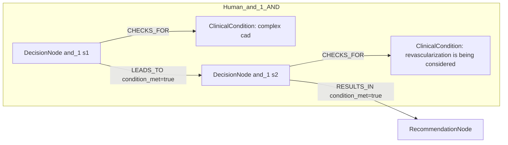
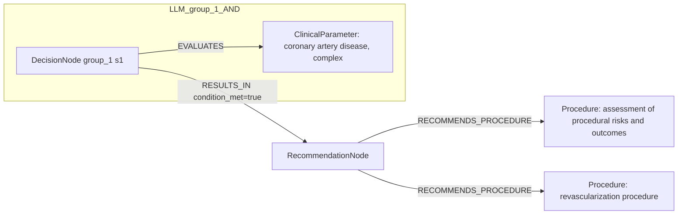

# row_13 (mapped to row_13)

Original table row text (ground truth):

```json
{
  "Recommendations": "In patients with complex CAD in whom revascularization is being considered, it is recommended to assess procedural risks and post-procedural outcomes to guide shared clinical decision-making.",
  "Class a": "I",
  "Level b": "C"
}
```

Aligned JSON (expected vs actual):

<table>
  <tr>
    <th align="left">Human Annotation</th>
    <th align="left">LLM Generated</th>
  </tr>
  <tr>
    <td valign="top"><pre>
[
  {
    "conditions": [
      {
        "entity": "complex cad",
        "entity_original": "patients with complex cad",
        "role": "ClinicalCondition",
        "operator": "PRESENT",
        "threshold": null,
        "unit": null,
        "context": null,
        "logic_type": "AND",
        "logic_group": "and_1",
        "strength": null,
        "level": null,
        "direction": null
      },
      {
        "entity": "revascularization is being considered",
        "entity_original": "patients in whom revascularization is being considered",
        "role": "ClinicalCondition",
        "operator": "PRESENT",
        "threshold": null,
        "unit": null,
        "context": null,
        "logic_type": "AND",
        "logic_group": "and_1",
        "strength": null,
        "level": null,
        "direction": null
      }
    ],
    "actions": [
      {
        "entity": "procedural risks",
        "entity_original": "assess procedural risks",
        "role": "ClinicalAction",
        "operator": null,
        "threshold": null,
        "unit": null,
        "context": null,
        "logic_type": null,
        "logic_group": null,
        "strength": "I",
        "level": "C",
        "direction": "POSITIVE"
      },
      {
        "entity": "post-procedural outcomes",
        "entity_original": "assess post-procedural outcomes",
        "role": "ClinicalAction",
        "operator": null,
        "threshold": null,
        "unit": null,
        "context": null,
        "logic_type": null,
        "logic_group": null,
        "strength": "I",
        "level": "C",
        "direction": "POSITIVE"
      },
      {
        "entity": "shared clinical decision-making",
        "entity_original": "take part in shared clinical decision-making",
        "role": "ClinicalAction",
        "operator": null,
        "threshold": null,
        "unit": null,
        "context": null,
        "logic_type": null,
        "logic_group": null,
        "strength": "I",
        "level": "C",
        "direction": "POSITIVE"
      }
    ]
  }
]
</pre></td>
    <td valign="top"><pre>
{
  "rules": [
    {
      "conditions": [],
      "actions": [
        {
          "entity": "revascularization procedure",
          "entity_original": "revascularization is being considered",
          "role": "Procedure",
          "operator": "PLANNED",
          "threshold": null,
          "unit": null,
          "context": null,
          "logic_type": null,
          "logic_group": null,
          "strength": "Class I",
          "level": "C",
          "direction": "POSITIVE",
          "preferred_term": "Limb revascularization (procedure)",
          "synonyms": [],
          "snomed_id": 233497001,
          "target_label": "Procedure",
          "taxonomy_path": [
            {
              "concept_id": "233497001",
              "term": "Limb revascularization (procedure)"
            },
            {
              "concept_id": "22701007",
              "term": "Operative procedure on artery of extremity (procedure)"
            },
            {
              "concept_id": "363187007",
              "term": "Limb operation (procedure)"
            },
            {
              "concept_id": "387713003",
              "term": "Surgical procedure (procedure)"
            },
            {
              "concept_id": "71388002",
              "term": "Procedure (procedure)"
            }
          ],
          "root_concept_id": "71388002",
          "root_concept_term": "Procedure (procedure)"
        },
        {
          "entity": "assessment of procedural risks and outcomes",
          "entity_original": "assess procedural risks and post-procedural outcomes",
          "role": "Procedure",
          "operator": null,
          "threshold": null,
          "unit": null,
          "context": null,
          "logic_type": null,
          "logic_group": null,
          "strength": "Class I",
          "level": "C",
          "direction": "POSITIVE",
          "preferred_term": "Assessment using Bakas Caregiving Outcomes Scales (procedure)",
          "synonyms": [
            "Assessment using Bakas Caregiving Outcomes Scales",
            "Assessment using BCOS (Bakas Caregiving Outcomes Scales)"
          ],
          "snomed_id": 865916003,
          "target_label": "Procedure",
          "taxonomy_path": [
            {
              "concept_id": "865916003",
              "term": "Assessment using Bakas Caregiving Outcomes Scales (procedure)"
            },
            {
              "concept_id": "445536008",
              "term": "Assessment using assessment scale (procedure)"
            },
            {
              "concept_id": "386053000",
              "term": "Evaluation procedure (procedure)"
            },
            {
              "concept_id": "128927009",
              "term": "Procedure by method (procedure)"
            },
            {
              "concept_id": "71388002",
              "term": "Procedure (procedure)"
            },
            {
              "concept_id": "138875005",
              "term": "SNOMED CT Concept (SNOMED RT+CTV3)"
            }
          ],
          "root_concept_id": "71388002",
          "root_concept_term": "Procedure (procedure)"
        }
      ]
    }
  ]
}
</pre></td>
  </tr>
</table>

Mermaid (Human Annotation):



Mermaid (LLM Generated):



Grounding summary (optional):

```json
{
  "enabled": true,
  "total_grounded": 2,
  "target_label_counts": {
    "Procedure": 2
  },
  "root_hit_counts": {
    "71388002": 2
  },
  "root_hits": [
    {
      "entity": "Revascularization Procedure",
      "entity_original": "revascularization is being considered",
      "role": "Procedure",
      "preferred_term": "Limb revascularization (procedure)",
      "synonyms": [],
      "snomed_id": 233497001,
      "target_label": "Procedure",
      "taxonomy_path": [
        {
          "concept_id": "233497001",
          "term": "Limb revascularization (procedure)"
        },
        {
          "concept_id": "22701007",
          "term": "Operative procedure on artery of extremity (procedure)"
        },
        {
          "concept_id": "363187007",
          "term": "Limb operation (procedure)"
        },
        {
          "concept_id": "387713003",
          "term": "Surgical procedure (procedure)"
        },
        {
          "concept_id": "71388002",
          "term": "Procedure (procedure)"
        }
      ],
      "root_hit": {
        "root_concept_id": "71388002",
        "root_concept_term": "Procedure (procedure)",
        "mapped_target_label": "Procedure"
      }
    },
    {
      "entity": "Assessment of Procedural Risks and Outcomes",
      "entity_original": "assess procedural risks and post-procedural outcomes",
      "role": "Procedure",
      "preferred_term": "Assessment using Bakas Caregiving Outcomes Scales (procedure)",
      "synonyms": [
        "Assessment using Bakas Caregiving Outcomes Scales",
        "Assessment using BCOS (Bakas Caregiving Outcomes Scales)"
      ],
      "snomed_id": 865916003,
      "target_label": "Procedure",
      "taxonomy_path": [
        {
          "concept_id": "865916003",
          "term": "Assessment using Bakas Caregiving Outcomes Scales (procedure)"
        },
        {
          "concept_id": "445536008",
          "term": "Assessment using assessment scale (procedure)"
        },
        {
          "concept_id": "386053000",
          "term": "Evaluation procedure (procedure)"
        },
        {
          "concept_id": "128927009",
          "term": "Procedure by method (procedure)"
        },
        {
          "concept_id": "71388002",
          "term": "Procedure (procedure)"
        },
        {
          "concept_id": "138875005",
          "term": "SNOMED CT Concept (SNOMED RT+CTV3)"
        }
      ],
      "root_hit": {
        "root_concept_id": "71388002",
        "root_concept_term": "Procedure (procedure)",
        "mapped_target_label": "Procedure"
      }
    }
  ]
}
```

Concepts:
- expected: 5
- actual: 3
- matches: 0
- missing: 5
- extra: 3

Missing concepts:
- ClinicalAction: post-procedural outcomes
- ClinicalAction: procedural risks
- ClinicalAction: shared clinical decision-making
- ClinicalCondition: complex cad
- ClinicalCondition: revascularization is being considered

Extra concepts:
- ClinicalParameter: coronary artery disease, complex
- Procedure: assessment of procedural risks and outcomes
- Procedure: revascularization procedure

Rules (concept + logic fields):
- expected: 5
- actual: 3
- matches: 0
- missing: 5
- extra: 3

Missing rules:
- ClinicalAction: post-procedural outcomes | class=I | level=C | dir=POSITIVE
- ClinicalAction: procedural risks | class=I | level=C | dir=POSITIVE
- ClinicalAction: shared clinical decision-making | class=I | level=C | dir=POSITIVE
- ClinicalCondition: complex cad | op=PRESENT | logic=AND | grp=and_1
- ClinicalCondition: revascularization is being considered | op=PRESENT | logic=AND | grp=and_1

Extra rules:
- ClinicalParameter: coronary artery disease, complex | op=PRESENT | class=Class I | level=C | dir=POSITIVE
- Procedure: assessment of procedural risks and outcomes | class=Class I | level=C | dir=POSITIVE
- Procedure: revascularization procedure | op=PLANNED | class=Class I | level=C | dir=POSITIVE

