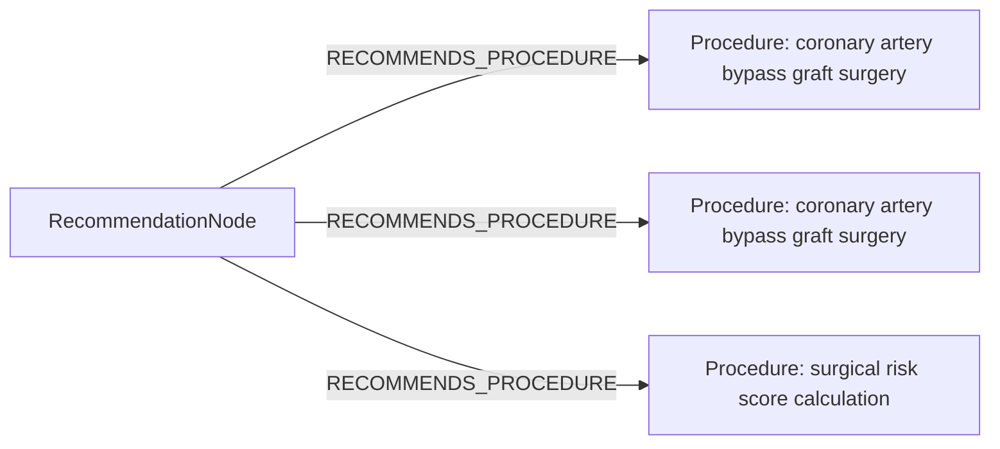

# row_14 (mapped to row_14)

Original table row text (ground truth):

```json
{
  "Recommendations": "Calculation of the STS score is recommended to estimate in-hospital morbidity and 30-day mortality after CABG. 777,862-864",
  "Class a": "I",
  "Level b": "B"
}
```

Aligned JSON (expected vs actual):

<table>
  <tr>
    <th align="left">Human Annotation</th>
    <th align="left">LLM Generated</th>
  </tr>
  <tr>
    <td valign="top"><pre>
[
  {
    "conditions": [
      {
        "entity": "cabg",
        "entity_original": "cabg",
        "role": "Procedure",
        "operator": "PRESENT",
        "threshold": null,
        "unit": null,
        "context": null,
        "logic_type": "AND",
        "logic_group": "and_1",
        "strength": null,
        "level": null,
        "direction": null
      }
    ],
    "actions": [
      {
        "entity": "sts score",
        "entity_original": "calculation of the sts score to estimate in-hospital morbidity and 30-day mortality after cabg",
        "role": "ClinicalAction",
        "operator": null,
        "threshold": null,
        "unit": null,
        "context": null,
        "logic_type": null,
        "logic_group": null,
        "strength": "I",
        "level": "B",
        "direction": "POSITIVE"
      }
    ]
  }
]
</pre></td>
    <td valign="top"><pre>
{
  "rules": [
    {
      "conditions": [
        {
          "entity": "coronary artery bypass graft surgery",
          "entity_original": "cabg",
          "role": "Procedure",
          "operator": "PLANNED",
          "threshold": null,
          "unit": null,
          "context": null,
          "logic_type": null,
          "logic_group": null,
          "strength": "Unknown",
          "level": "Unknown",
          "direction": null,
          "preferred_term": "Aortocoronary artery bypass graft with vein graft (procedure)",
          "synonyms": [
            "Aortocoronary artery bypass graft with vein graft",
            "ACVG - aortocoronary vein graft",
            "CAVG - coronary artery vein graft",
            "CVG - coronary vein graft"
          ],
          "snomed_id": 17073005,
          "target_label": "Procedure",
          "taxonomy_path": [
            {
              "concept_id": "17073005",
              "term": "Aortocoronary artery bypass graft with vein graft (procedure)"
            },
            {
              "concept_id": "287347004",
              "term": "Arterial bypass using vein graft (procedure)"
            },
            {
              "concept_id": "116360008",
              "term": "Arterial bypass graft (procedure)"
            },
            {
              "concept_id": "23075000",
              "term": "Creation of vascular bypass (procedure)"
            },
            {
              "concept_id": "48537004",
              "term": "Bypass graft (procedure)"
            },
            {
              "concept_id": "78817002",
              "term": "Construction of anastomosis (procedure)"
            },
            {
              "concept_id": "410614008",
              "term": "Construction (procedure)"
            },
            {
              "concept_id": "4365001",
              "term": "Surgical repair (procedure)"
            },
            {
              "concept_id": "387713003",
              "term": "Surgical procedure (procedure)"
            },
            {
              "concept_id": "71388002",
              "term": "Procedure (procedure)"
            }
          ],
          "root_concept_id": "71388002",
          "root_concept_term": "Procedure (procedure)"
        },
        {
          "entity": "coronary artery bypass graft surgery",
          "entity_original": "cabg",
          "role": "Procedure",
          "operator": "PRESENT",
          "threshold": null,
          "unit": null,
          "context": null,
          "logic_type": null,
          "logic_group": null,
          "strength": "Unknown",
          "level": "Unknown",
          "direction": null,
          "preferred_term": "Aortocoronary artery bypass graft with vein graft (procedure)",
          "synonyms": [
            "Aortocoronary artery bypass graft with vein graft",
            "ACVG - aortocoronary vein graft",
            "CAVG - coronary artery vein graft",
            "CVG - coronary vein graft"
          ],
          "snomed_id": 17073005,
          "target_label": "Procedure",
          "taxonomy_path": [
            {
              "concept_id": "17073005",
              "term": "Aortocoronary artery bypass graft with vein graft (procedure)"
            },
            {
              "concept_id": "287347004",
              "term": "Arterial bypass using vein graft (procedure)"
            },
            {
              "concept_id": "116360008",
              "term": "Arterial bypass graft (procedure)"
            },
            {
              "concept_id": "23075000",
              "term": "Creation of vascular bypass (procedure)"
            },
            {
              "concept_id": "48537004",
              "term": "Bypass graft (procedure)"
            },
            {
              "concept_id": "78817002",
              "term": "Construction of anastomosis (procedure)"
            },
            {
              "concept_id": "410614008",
              "term": "Construction (procedure)"
            },
            {
              "concept_id": "4365001",
              "term": "Surgical repair (procedure)"
            },
            {
              "concept_id": "387713003",
              "term": "Surgical procedure (procedure)"
            },
            {
              "concept_id": "71388002",
              "term": "Procedure (procedure)"
            }
          ],
          "root_concept_id": "71388002",
          "root_concept_term": "Procedure (procedure)"
        }
      ],
      "actions": []
    }
  ]
}
</pre></td>
  </tr>
</table>

Mermaid (Human Annotation):


Mermaid (LLM Generated):



Grounding summary (optional):

```json
{
  "enabled": true,
  "total_grounded": 2,
  "target_label_counts": {
    "Procedure": 2
  },
  "root_hit_counts": {
    "71388002": 2
  },
  "root_hits": [
    {
      "entity": "Coronary artery bypass graft surgery",
      "entity_original": "CABG",
      "role": "Procedure",
      "preferred_term": "Aortocoronary artery bypass graft with vein graft (procedure)",
      "synonyms": [
        "Aortocoronary artery bypass graft with vein graft",
        "ACVG - aortocoronary vein graft",
        "CAVG - coronary artery vein graft",
        "CVG - coronary vein graft"
      ],
      "snomed_id": 17073005,
      "target_label": "Procedure",
      "taxonomy_path": [
        {
          "concept_id": "17073005",
          "term": "Aortocoronary artery bypass graft with vein graft (procedure)"
        },
        {
          "concept_id": "287347004",
          "term": "Arterial bypass using vein graft (procedure)"
        },
        {
          "concept_id": "116360008",
          "term": "Arterial bypass graft (procedure)"
        },
        {
          "concept_id": "23075000",
          "term": "Creation of vascular bypass (procedure)"
        },
        {
          "concept_id": "48537004",
          "term": "Bypass graft (procedure)"
        },
        {
          "concept_id": "78817002",
          "term": "Construction of anastomosis (procedure)"
        },
        {
          "concept_id": "410614008",
          "term": "Construction (procedure)"
        },
        {
          "concept_id": "4365001",
          "term": "Surgical repair (procedure)"
        },
        {
          "concept_id": "387713003",
          "term": "Surgical procedure (procedure)"
        },
        {
          "concept_id": "71388002",
          "term": "Procedure (procedure)"
        }
      ],
      "root_hit": {
        "root_concept_id": "71388002",
        "root_concept_term": "Procedure (procedure)",
        "mapped_target_label": "Procedure"
      }
    },
    {
      "entity": "Coronary artery bypass graft surgery",
      "entity_original": "CABG",
      "role": "Procedure",
      "preferred_term": "Aortocoronary artery bypass graft with vein graft (procedure)",
      "synonyms": [
        "Aortocoronary artery bypass graft with vein graft",
        "ACVG - aortocoronary vein graft",
        "CAVG - coronary artery vein graft",
        "CVG - coronary vein graft"
      ],
      "snomed_id": 17073005,
      "target_label": "Procedure",
      "taxonomy_path": [
        {
          "concept_id": "17073005",
          "term": "Aortocoronary artery bypass graft with vein graft (procedure)"
        },
        {
          "concept_id": "287347004",
          "term": "Arterial bypass using vein graft (procedure)"
        },
        {
          "concept_id": "116360008",
          "term": "Arterial bypass graft (procedure)"
        },
        {
          "concept_id": "23075000",
          "term": "Creation of vascular bypass (procedure)"
        },
        {
          "concept_id": "48537004",
          "term": "Bypass graft (procedure)"
        },
        {
          "concept_id": "78817002",
          "term": "Construction of anastomosis (procedure)"
        },
        {
          "concept_id": "410614008",
          "term": "Construction (procedure)"
        },
        {
          "concept_id": "4365001",
          "term": "Surgical repair (procedure)"
        },
        {
          "concept_id": "387713003",
          "term": "Surgical procedure (procedure)"
        },
        {
          "concept_id": "71388002",
          "term": "Procedure (procedure)"
        }
      ],
      "root_hit": {
        "root_concept_id": "71388002",
        "root_concept_term": "Procedure (procedure)",
        "mapped_target_label": "Procedure"
      }
    }
  ]
}
```

Concepts:
- expected: 2
- actual: 2
- matches: 0
- missing: 2
- extra: 2

Missing concepts:
- ClinicalAction: sts score
- Procedure: cabg

Extra concepts:
- Procedure: coronary artery bypass graft surgery
- Procedure: surgical risk score calculation

Rules (concept + logic fields):
- expected: 2
- actual: 3
- matches: 0
- missing: 2
- extra: 3

Missing rules:
- ClinicalAction: sts score | class=I | level=B | dir=POSITIVE
- Procedure: cabg | op=PRESENT | logic=AND | grp=and_1

Extra rules:
- Procedure: coronary artery bypass graft surgery | op=PLANNED | class=Unknown | level=Unknown
- Procedure: coronary artery bypass graft surgery | op=PRESENT | class=Unknown | level=Unknown
- Procedure: surgical risk score calculation | class=Class I | level=B | dir=POSITIVE

