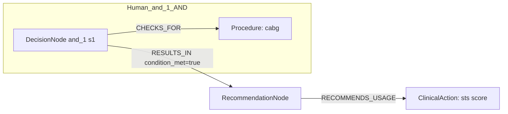
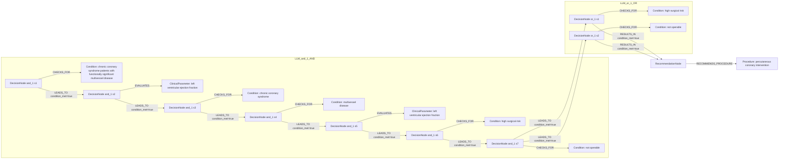

# row_14 (mapped to row_15)

Original table row text (ground truth):

```json
{
  "Recommendations": "Calculation of the STS score is recommended to estimate in-hospital morbidity and 30-day mortality after CABG. 777,862-864",
  "Class a": "I",
  "Level b": "B"
}
```

Aligned JSON (expected vs actual):

<table>
  <tr>
    <th align="left">Human Annotation</th>
    <th align="left">LLM Generated</th>
  </tr>
  <tr>
    <td valign="top"><pre>
[
  {
    "conditions": [
      {
        "entity": "cabg",
        "entity_original": "cabg",
        "role": "Procedure",
        "operator": "PRESENT",
        "threshold": null,
        "unit": null,
        "context": null,
        "logic_type": "AND",
        "logic_group": "and_1",
        "strength": null,
        "level": null,
        "direction": null
      }
    ],
    "actions": [
      {
        "entity": "sts score",
        "entity_original": "calculation of the sts score to estimate in-hospital morbidity and 30-day mortality after cabg",
        "role": "ClinicalAction",
        "operator": null,
        "threshold": null,
        "unit": null,
        "context": null,
        "logic_type": null,
        "logic_group": null,
        "strength": "I",
        "level": "B",
        "direction": "POSITIVE"
      }
    ]
  }
]
</pre></td>
    <td valign="top"><pre>
{
  "rules": [
    {
      "conditions": [
        {
          "entity": "chronic coronary syndrome patients with functionally significant multivessel disease",
          "entity_original": "chronic coronary syndrome patients with functionally significant multivessel disease",
          "role": "Condition",
          "operator": "PRESENT",
          "threshold": null,
          "unit": null,
          "context": null,
          "logic_type": "AND",
          "logic_group": "and_1",
          "strength": "Class IIb",
          "level": "B",
          "direction": "POSITIVE",
          "preferred_term": null,
          "synonyms": [],
          "snomed_id": null,
          "target_label": null,
          "taxonomy_path": [],
          "root_concept_id": null,
          "root_concept_term": null
        },
        {
          "entity": "left ventricular ejection fraction",
          "entity_original": "left ventricular ejection fraction",
          "role": "ClinicalParameter",
          "operator": "<=",
          "threshold": "35",
          "unit": "%",
          "context": null,
          "logic_type": "AND",
          "logic_group": "and_1",
          "strength": "Class IIb",
          "level": "B",
          "direction": "POSITIVE",
          "preferred_term": null,
          "synonyms": [],
          "snomed_id": null,
          "target_label": null,
          "taxonomy_path": [],
          "root_concept_id": null,
          "root_concept_term": null
        },
        {
          "entity": "high surgical risk",
          "entity_original": "high surgical risk or not operable",
          "role": "Condition",
          "operator": "PRESENT",
          "threshold": null,
          "unit": null,
          "context": null,
          "logic_type": "OR",
          "logic_group": "or_1",
          "strength": "Class IIb",
          "level": "B",
          "direction": "POSITIVE",
          "preferred_term": null,
          "synonyms": [],
          "snomed_id": null,
          "target_label": null,
          "taxonomy_path": [],
          "root_concept_id": null,
          "root_concept_term": null
        },
        {
          "entity": "not operable",
          "entity_original": "high surgical risk or not operable",
          "role": "Condition",
          "operator": "PRESENT",
          "threshold": null,
          "unit": null,
          "context": null,
          "logic_type": "OR",
          "logic_group": "or_1",
          "strength": "Class IIb",
          "level": "B",
          "direction": "POSITIVE",
          "preferred_term": null,
          "synonyms": [],
          "snomed_id": null,
          "target_label": null,
          "taxonomy_path": [],
          "root_concept_id": null,
          "root_concept_term": null
        },
        {
          "entity": "chronic coronary syndrome",
          "entity_original": "chronic coronary syndrome (ccs)",
          "role": "Condition",
          "operator": "PRESENT",
          "threshold": null,
          "unit": null,
          "context": null,
          "logic_type": "AND",
          "logic_group": "and_1",
          "strength": "Class IIb",
          "level": "B",
          "direction": "UNKNOWN",
          "preferred_term": null,
          "synonyms": [],
          "snomed_id": null,
          "target_label": null,
          "taxonomy_path": [],
          "root_concept_id": null,
          "root_concept_term": null
        },
        {
          "entity": "multivessel disease",
          "entity_original": "multivessel disease (mvd)",
          "role": "Condition",
          "operator": "PRESENT",
          "threshold": null,
          "unit": null,
          "context": null,
          "logic_type": "AND",
          "logic_group": "and_1",
          "strength": "Class IIb",
          "level": "B",
          "direction": "UNKNOWN",
          "preferred_term": null,
          "synonyms": [],
          "snomed_id": null,
          "target_label": null,
          "taxonomy_path": [],
          "root_concept_id": null,
          "root_concept_term": null
        },
        {
          "entity": "left ventricular ejection fraction",
          "entity_original": "left ventricular ejection fraction (lvef) \u2264 35%",
          "role": "ClinicalParameter",
          "operator": "LE",
          "threshold": "35",
          "unit": "%",
          "context": null,
          "logic_type": "AND",
          "logic_group": "and_1",
          "strength": "Class IIb",
          "level": "B",
          "direction": "UNKNOWN",
          "preferred_term": null,
          "synonyms": [],
          "snomed_id": null,
          "target_label": null,
          "taxonomy_path": [],
          "root_concept_id": null,
          "root_concept_term": null
        },
        {
          "entity": "high surgical risk",
          "entity_original": "high surgical risk",
          "role": "Condition",
          "operator": "PRESENT",
          "threshold": null,
          "unit": null,
          "context": null,
          "logic_type": "AND",
          "logic_group": "and_1",
          "strength": "Class IIb",
          "level": "B",
          "direction": "UNKNOWN",
          "preferred_term": null,
          "synonyms": [],
          "snomed_id": null,
          "target_label": null,
          "taxonomy_path": [],
          "root_concept_id": null,
          "root_concept_term": null
        },
        {
          "entity": "not operable",
          "entity_original": "not operable",
          "role": "Condition",
          "operator": "PRESENT",
          "threshold": null,
          "unit": null,
          "context": null,
          "logic_type": "AND",
          "logic_group": "and_1",
          "strength": "Class IIb",
          "level": "B",
          "direction": "UNKNOWN",
          "preferred_term": null,
          "synonyms": [],
          "snomed_id": null,
          "target_label": null,
          "taxonomy_path": [],
          "root_concept_id": null,
          "root_concept_term": null
        }
      ],
      "actions": [
        {
          "entity": "percutaneous coronary intervention",
          "entity_original": "percutaneous coronary intervention",
          "role": "Procedure",
          "operator": "PRESENT",
          "threshold": null,
          "unit": null,
          "context": null,
          "logic_type": null,
          "logic_group": null,
          "strength": "Class IIb",
          "level": "B",
          "direction": "POSITIVE",
          "preferred_term": null,
          "synonyms": [],
          "snomed_id": null,
          "target_label": null,
          "taxonomy_path": [],
          "root_concept_id": null,
          "root_concept_term": null
        }
      ]
    }
  ]
}
</pre></td>
  </tr>
</table>

Mermaid (Human Annotation):



Mermaid (LLM Generated):



Concepts:
- expected: 2
- actual: 7
- matches: 0
- missing: 2
- extra: 7

Missing concepts:
- ClinicalAction: sts score
- Procedure: cabg

Extra concepts:
- ClinicalParameter: left ventricular ejection fraction
- Condition: chronic coronary syndrome
- Condition: chronic coronary syndrome patients with functionally significant multivessel disease
- Condition: high surgical risk
- Condition: multivessel disease
- Condition: not operable
- Procedure: percutaneous coronary intervention

Rules (concept + logic fields):
- expected: 2
- actual: 10
- matches: 0
- missing: 2
- extra: 10

Missing rules:
- ClinicalAction: sts score | class=I | level=B | dir=POSITIVE
- Procedure: cabg | op=PRESENT | logic=AND | grp=and_1

Extra rules:
- ClinicalParameter: left ventricular ejection fraction | op=<= | thr=35 | unit=% | logic=AND | grp=and_1 | class=Class IIb | level=B | dir=POSITIVE
- ClinicalParameter: left ventricular ejection fraction | op=LE | thr=35 | unit=% | logic=AND | grp=and_1 | class=Class IIb | level=B | dir=UNKNOWN
- Condition: chronic coronary syndrome patients with functionally significant multivessel disease | op=PRESENT | logic=AND | grp=and_1 | class=Class IIb | level=B | dir=POSITIVE
- Condition: chronic coronary syndrome | op=PRESENT | logic=AND | grp=and_1 | class=Class IIb | level=B | dir=UNKNOWN
- Condition: high surgical risk | op=PRESENT | logic=AND | grp=and_1 | class=Class IIb | level=B | dir=UNKNOWN
- Condition: high surgical risk | op=PRESENT | logic=OR | grp=or_1 | class=Class IIb | level=B | dir=POSITIVE
- Condition: multivessel disease | op=PRESENT | logic=AND | grp=and_1 | class=Class IIb | level=B | dir=UNKNOWN
- Condition: not operable | op=PRESENT | logic=AND | grp=and_1 | class=Class IIb | level=B | dir=UNKNOWN
- Condition: not operable | op=PRESENT | logic=OR | grp=or_1 | class=Class IIb | level=B | dir=POSITIVE
- Procedure: percutaneous coronary intervention | op=PRESENT | class=Class IIb | level=B | dir=POSITIVE
