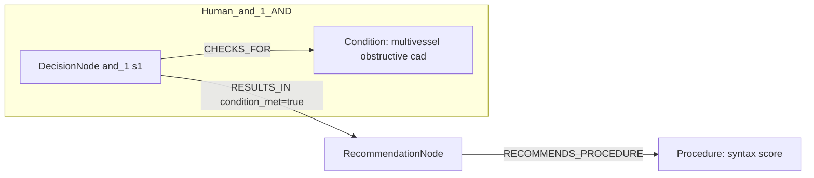
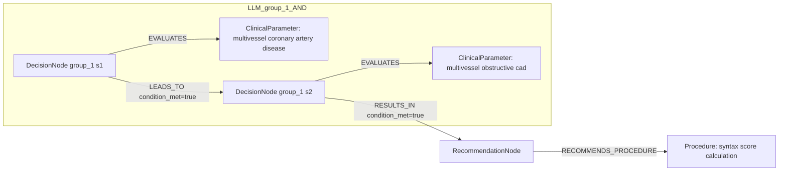

# row_15 (mapped to row_15)

Original table row text (ground truth):

```json
{
  "Recommendations": "In patients with multivessel obstructive CAD, calculation of the SYNTAX score is recommended to assess the anatomical complexity of disease. 786,865",
  "Class a": "I",
  "Level b": "B"
}
```

Aligned JSON (expected vs actual):

<table>
  <tr>
    <th align="left">Human Annotation</th>
    <th align="left">LLM Generated</th>
  </tr>
  <tr>
    <td valign="top"><pre>
[
  {
    "rule_id": 1,
    "conditions": [
      {
        "entity": "multivessel obstructive cad",
        "entity_original": "patients with multivessel obstructive cad",
        "role": "Condition",
        "operator": "PRESENT",
        "threshold": null,
        "unit": null,
        "condition_context": null,
        "logic_type": "AND",
        "logic_group": "and_1",
        "strength": null,
        "level": null,
        "direction": null
      }
    ],
    "actions": [
      {
        "entity": "syntax score",
        "entity_original": "calculation of the syntax score is recommended to assess the anatomical complexity of disease",
        "role": "Procedure",
        "operator": null,
        "threshold": null,
        "unit": null,
        "condition_context": null,
        "logic_type": null,
        "logic_group": null,
        "strength": "I",
        "level": "B",
        "direction": "POSITIVE"
      }
    ]
  }
]
</pre></td>
    <td valign="top"><pre>
{
  "1": {
    "conditions": [
      {
        "entity": "multivessel obstructive cad",
        "entity_original": "multivessel obstructive cad",
        "role": "ClinicalParameter",
        "operator": "PRESENT",
        "threshold": null,
        "unit": null,
        "condition_context": null,
        "logic_type": null,
        "logic_group": null,
        "strength": "I",
        "level": "B",
        "direction": "POSITIVE",
        "rule_id": 1,
        "side": "condition",
        "preferred_term": null,
        "synonyms": [],
        "snomed_id": null,
        "target_label": "ClinicalParameter",
        "taxonomy_path": [],
        "root_concept_id": null,
        "root_concept_term": null,
        "mapped_target_label": null
      },
      {
        "entity": "multivessel coronary artery disease",
        "entity_original": "multivessel obstructive cad",
        "role": "ClinicalParameter",
        "operator": "PRESENT",
        "threshold": null,
        "unit": null,
        "condition_context": null,
        "logic_type": null,
        "logic_group": null,
        "strength": "Unknown",
        "level": "Unknown",
        "direction": "UNKNOWN",
        "rule_id": 1,
        "side": "condition",
        "preferred_term": "Coronary artery disease (disorder)",
        "synonyms": [],
        "snomed_id": 8957000,
        "target_label": "ClinicalCondition",
        "taxonomy_path": [
          {
            "concept_id": "8957000",
            "term": "Coronary artery disease (disorder)"
          }
        ],
        "root_concept_id": null,
        "root_concept_term": null,
        "mapped_target_label": null
      }
    ],
    "actions": []
  }
}
</pre></td>
  </tr>
</table>

Mermaid (Human Annotation):



Mermaid (LLM Generated):



Grounding summary (optional):

```json
{
  "enabled": true,
  "total_grounded": 2,
  "target_label_counts": {
    "ClinicalParameter": 1,
    "ClinicalCondition": 1
  },
  "root_hit_counts": {},
  "root_hits": [
    {
      "entity": "multivessel obstructive CAD",
      "entity_original": "multivessel obstructive CAD",
      "role": "ClinicalParameter",
      "preferred_term": null,
      "synonyms": [],
      "snomed_id": null,
      "target_label": "ClinicalParameter",
      "taxonomy_path": [],
      "root_hit": null
    },
    {
      "entity": "Multivessel Coronary Artery Disease",
      "entity_original": "multivessel obstructive CAD",
      "role": "ClinicalParameter",
      "preferred_term": "Coronary artery disease (disorder)",
      "synonyms": [],
      "snomed_id": 8957000,
      "target_label": "ClinicalCondition",
      "taxonomy_path": [
        {
          "concept_id": "8957000",
          "term": "Coronary artery disease (disorder)"
        }
      ],
      "root_hit": null
    }
  ]
}
```

Concepts:
- expected: 2
- actual: 3
- matches: 0
- missing: 2
- extra: 3

Missing concepts:
- Condition: multivessel obstructive cad
- Procedure: syntax score

Extra concepts:
- ClinicalParameter: multivessel coronary artery disease
- ClinicalParameter: multivessel obstructive cad
- Procedure: syntax score calculation

Rules (concept + logic fields):
- expected: 2
- actual: 3
- matches: 0
- missing: 2
- extra: 3

Missing rules:
- Condition: multivessel obstructive cad | op=PRESENT | logic=AND | grp=and_1
- Procedure: syntax score | class=I | level=B | dir=POSITIVE

Extra rules:
- ClinicalParameter: multivessel coronary artery disease | op=PRESENT | class=Unknown | level=Unknown | dir=UNKNOWN
- ClinicalParameter: multivessel obstructive cad | op=PRESENT | class=I | level=B | dir=POSITIVE
- Procedure: syntax score calculation | class=I | level=B | dir=POSITIVE

