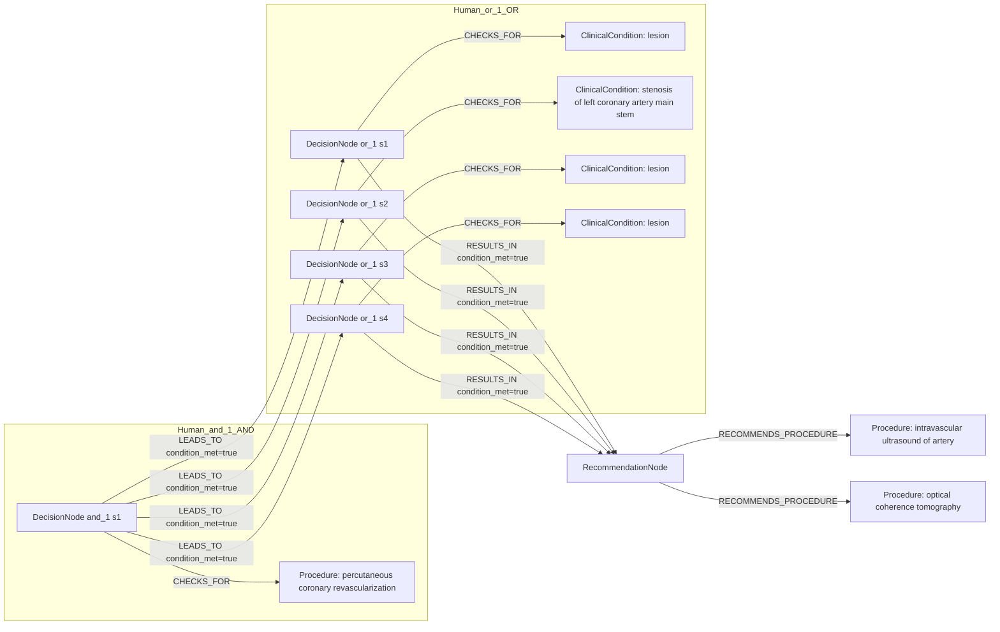
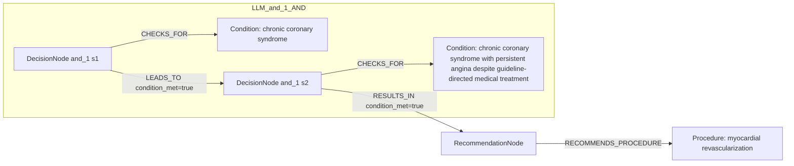

# row_16 (mapped to row_17)

Original table row text (ground truth):

```json
{
  "Recommendations": "Intracoronary imaging guidance by IVUS or OCTis recommended when performing PCI on anatomically complex lesions, in particular left main stem, true bifurcations, and long lesions. 866,337,810,840,841",
  "Class a": "I",
  "Level b": "A"
}
```

Aligned JSON (expected vs actual):

<table>
  <tr>
    <th align="left">Human Annotation</th>
    <th align="left">LLM Generated</th>
  </tr>
  <tr>
    <td valign="top"><pre>
[
  {
    "conditions": [
      {
        "entity": "percutaneous coronary revascularization",
        "entity_original": "pci",
        "role": "Procedure",
        "operator": "PRESENT",
        "threshold": null,
        "unit": null,
        "context": null,
        "logic_type": "AND",
        "logic_group": "and_1",
        "strength": null,
        "level": null,
        "direction": null,
        "preferred_term": null,
        "synonyms": [],
        "snomed_id": "415070008",
        "target_label": null,
        "taxonomy_path": [],
        "root_concept_id": null,
        "root_concept_term": null
      },
      {
        "entity": "lesion",
        "entity_original": "anatomically complex lesions",
        "role": "ClinicalCondition",
        "operator": "PRESENT",
        "threshold": null,
        "unit": null,
        "context": null,
        "logic_type": "OR",
        "logic_group": "or_1",
        "strength": null,
        "level": null,
        "direction": null,
        "preferred_term": null,
        "synonyms": [],
        "snomed_id": "52988006",
        "target_label": null,
        "taxonomy_path": [],
        "root_concept_id": null,
        "root_concept_term": null
      },
      {
        "entity": "stenosis of left coronary artery main stem",
        "entity_original": "left main stem lesions",
        "role": "ClinicalCondition",
        "operator": "PRESENT",
        "threshold": null,
        "unit": null,
        "context": null,
        "logic_type": "OR",
        "logic_group": "or_1",
        "strength": null,
        "level": null,
        "direction": null,
        "preferred_term": null,
        "synonyms": [],
        "snomed_id": "876857001",
        "target_label": null,
        "taxonomy_path": [],
        "root_concept_id": null,
        "root_concept_term": null
      },
      {
        "entity": "lesion",
        "entity_original": "true bifurcations lesions",
        "role": "ClinicalCondition",
        "operator": "PRESENT",
        "threshold": null,
        "unit": null,
        "context": null,
        "logic_type": "OR",
        "logic_group": "or_1",
        "strength": null,
        "level": null,
        "direction": null,
        "preferred_term": null,
        "synonyms": [],
        "snomed_id": "52988006",
        "target_label": null,
        "taxonomy_path": [],
        "root_concept_id": null,
        "root_concept_term": null
      },
      {
        "entity": "lesion",
        "entity_original": "long lesions",
        "role": "ClinicalCondition",
        "operator": "PRESENT",
        "threshold": null,
        "unit": null,
        "context": null,
        "logic_type": "OR",
        "logic_group": "or_1",
        "strength": null,
        "level": null,
        "direction": null,
        "preferred_term": null,
        "synonyms": [],
        "snomed_id": "52988006",
        "target_label": null,
        "taxonomy_path": [],
        "root_concept_id": null,
        "root_concept_term": null
      }
    ],
    "actions": [
      {
        "entity": "intravascular ultrasound of artery",
        "entity_original": "intracoronary imaging guidance by ivus recommended",
        "role": "Procedure",
        "operator": null,
        "threshold": null,
        "unit": null,
        "context": null,
        "logic_type": null,
        "logic_group": null,
        "strength": "I",
        "level": "A",
        "direction": "POSITIVE",
        "preferred_term": null,
        "synonyms": [],
        "snomed_id": "241467003",
        "target_label": null,
        "taxonomy_path": [],
        "root_concept_id": null,
        "root_concept_term": null
      },
      {
        "entity": "optical coherence tomography",
        "entity_original": "intracoronary imaging guidance by octis recommended",
        "role": "Procedure",
        "operator": null,
        "threshold": null,
        "unit": null,
        "context": null,
        "logic_type": null,
        "logic_group": null,
        "strength": "I",
        "level": "A",
        "direction": "POSITIVE",
        "preferred_term": null,
        "synonyms": [],
        "snomed_id": "392010000",
        "target_label": null,
        "taxonomy_path": [],
        "root_concept_id": null,
        "root_concept_term": null
      }
    ]
  }
]
</pre></td>
    <td valign="top"><pre>
{
  "rules": [
    {
      "conditions": [
        {
          "entity": "chronic coronary syndrome",
          "entity_original": "chronic coronary syndrome (ccs) patients with persistent angina or anginal equivalent, despite guideline-directed medical treatment",
          "role": "Condition",
          "operator": "PRESENT",
          "threshold": null,
          "unit": null,
          "context": null,
          "logic_type": "AND",
          "logic_group": "and_1",
          "strength": "Class I",
          "level": "A",
          "direction": "POSITIVE"
        },
        {
          "entity": "chronic coronary syndrome with persistent angina despite guideline-directed medical treatment",
          "entity_original": "chronic coronary syndrome (ccs) patients with persistent angina or anginal equivalent, despite guideline-directed medical treatment",
          "role": "Condition",
          "operator": "PRESENT",
          "threshold": null,
          "unit": null,
          "context": null,
          "logic_type": "AND",
          "logic_group": "and_1",
          "strength": "Class I",
          "level": "A",
          "direction": "UNKNOWN"
        }
      ],
      "actions": [
        {
          "entity": "myocardial revascularization",
          "entity_original": "myocardial revascularization of functionally significant obstructive coronary artery disease (cad)",
          "role": "Procedure",
          "operator": null,
          "threshold": null,
          "unit": null,
          "context": null,
          "logic_type": null,
          "logic_group": null,
          "strength": "Class I",
          "level": "A",
          "direction": "POSITIVE"
        }
      ]
    }
  ]
}
</pre></td>
  </tr>
</table>

Mermaid (Human Annotation):



Mermaid (LLM Generated):



Concepts:
- expected: 5
- actual: 3
- matches: 0
- missing: 5
- extra: 3

Missing concepts:
- ClinicalCondition: lesion
- ClinicalCondition: stenosis of left coronary artery main stem
- Procedure: intravascular ultrasound of artery
- Procedure: optical coherence tomography
- Procedure: percutaneous coronary revascularization

Extra concepts:
- Condition: chronic coronary syndrome
- Condition: chronic coronary syndrome with persistent angina despite guideline-directed medical treatment
- Procedure: myocardial revascularization

Rules (concept + logic fields):
- expected: 5
- actual: 3
- matches: 0
- missing: 5
- extra: 3

Missing rules:
- ClinicalCondition: lesion | op=PRESENT | logic=OR | grp=or_1
- ClinicalCondition: stenosis of left coronary artery main stem | op=PRESENT | logic=OR | grp=or_1
- Procedure: intravascular ultrasound of artery | class=I | level=A | dir=POSITIVE
- Procedure: optical coherence tomography | class=I | level=A | dir=POSITIVE
- Procedure: percutaneous coronary revascularization | op=PRESENT | logic=AND | grp=and_1

Extra rules:
- Condition: chronic coronary syndrome with persistent angina despite guideline-directed medical treatment | op=PRESENT | logic=AND | grp=and_1 | class=Class I | level=A | dir=UNKNOWN
- Condition: chronic coronary syndrome | op=PRESENT | logic=AND | grp=and_1 | class=Class I | level=A | dir=POSITIVE
- Procedure: myocardial revascularization | class=Class I | level=A | dir=POSITIVE

