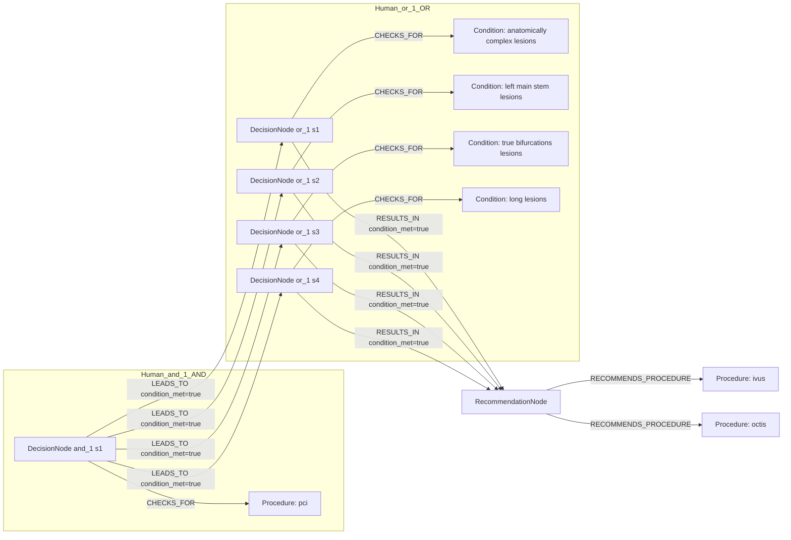
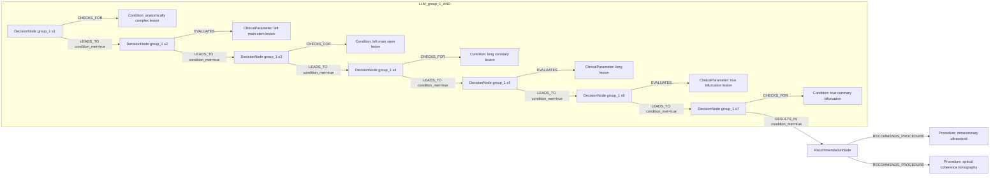

# row_16 (mapped to row_16)

Original table row text (ground truth):

```json
{
  "Recommendations": "Intracoronary imaging guidance by IVUS or OCTis recommended when performing PCI on anatomically complex lesions, in particular left main stem, true bifurcations, and long lesions. 866,337,810,840,841",
  "Class a": "I",
  "Level b": "A"
}
```

Aligned JSON (expected vs actual):

<table>
  <tr>
    <th align="left">Human Annotation</th>
    <th align="left">LLM Generated</th>
  </tr>
  <tr>
    <td valign="top"><pre>
[
  {
    "rule_id": 1,
    "conditions": [
      {
        "entity": "pci",
        "entity_original": "pci",
        "role": "Procedure",
        "operator": "PRESENT",
        "threshold": null,
        "unit": null,
        "condition_context": null,
        "logic_type": "AND",
        "logic_group": "and_1",
        "strength": null,
        "level": null,
        "direction": null
      },
      {
        "entity": "anatomically complex lesions",
        "entity_original": "anatomically complex lesions",
        "role": "Condition",
        "operator": "PRESENT",
        "threshold": null,
        "unit": null,
        "condition_context": null,
        "logic_type": "OR",
        "logic_group": "or_1",
        "strength": null,
        "level": null,
        "direction": null
      },
      {
        "entity": "left main stem lesions",
        "entity_original": "left main stem lesions",
        "role": "Condition",
        "operator": "PRESENT",
        "threshold": null,
        "unit": null,
        "condition_context": null,
        "logic_type": "OR",
        "logic_group": "or_1",
        "strength": null,
        "level": null,
        "direction": null
      },
      {
        "entity": "true bifurcations lesions",
        "entity_original": "true bifurcations lesions",
        "role": "Condition",
        "operator": "PRESENT",
        "threshold": null,
        "unit": null,
        "condition_context": null,
        "logic_type": "OR",
        "logic_group": "or_1",
        "strength": null,
        "level": null,
        "direction": null
      },
      {
        "entity": "long lesions",
        "entity_original": "long lesions",
        "role": "Condition",
        "operator": "PRESENT",
        "threshold": null,
        "unit": null,
        "condition_context": null,
        "logic_type": "OR",
        "logic_group": "or_1",
        "strength": null,
        "level": null,
        "direction": null
      }
    ],
    "actions": [
      {
        "entity": "ivus",
        "entity_original": "intracoronary imaging guidance by ivus recommended",
        "role": "Procedure",
        "operator": null,
        "threshold": null,
        "unit": null,
        "condition_context": null,
        "logic_type": null,
        "logic_group": null,
        "strength": "I",
        "level": "A",
        "direction": "POSITIVE"
      },
      {
        "entity": "octis",
        "entity_original": "intracoronary imaging guidance by octis recommended",
        "role": "Procedure",
        "operator": null,
        "threshold": null,
        "unit": null,
        "condition_context": null,
        "logic_type": null,
        "logic_group": null,
        "strength": "I",
        "level": "A",
        "direction": "POSITIVE"
      }
    ]
  }
]
</pre></td>
    <td valign="top"><pre>
{
  "1": {
    "conditions": [
      {
        "entity": "anatomically complex lesion",
        "entity_original": "anatomically complex lesions",
        "role": "Condition",
        "operator": "PRESENT",
        "threshold": null,
        "unit": null,
        "condition_context": null,
        "logic_type": null,
        "logic_group": null,
        "strength": "I",
        "level": "A",
        "direction": "POSITIVE",
        "rule_id": 1,
        "side": "condition",
        "preferred_term": "Lumbosacral plexus lesion (disorder)",
        "synonyms": [
          "Lumbosacral plexus lesion"
        ],
        "snomed_id": 4062006,
        "target_label": "ClinicalCondition",
        "taxonomy_path": [
          {
            "concept_id": "4062006",
            "term": "Lumbosacral plexus lesion (disorder)"
          },
          {
            "concept_id": "239953001",
            "term": "Lesion of soft tissue (disorder)"
          },
          {
            "concept_id": "19660004",
            "term": "Disorder of soft tissue (disorder)"
          },
          {
            "concept_id": "64572001",
            "term": "Disease (disorder)"
          },
          {
            "concept_id": "404684003",
            "term": "Clinical finding (finding)"
          },
          {
            "concept_id": "138875005",
            "term": "SNOMED CT Concept (SNOMED RT+CTV3)"
          }
        ],
        "root_concept_id": "404684003",
        "root_concept_term": "Clinical finding (finding)",
        "mapped_target_label": "ClinicalCondition"
      },
      {
        "entity": "true coronary bifurcation",
        "entity_original": "true bifurcations",
        "role": "Condition",
        "operator": "PRESENT",
        "threshold": null,
        "unit": null,
        "condition_context": null,
        "logic_type": null,
        "logic_group": null,
        "strength": "I",
        "level": "A",
        "direction": "POSITIVE",
        "rule_id": 1,
        "side": "condition",
        "preferred_term": null,
        "synonyms": [],
        "snomed_id": null,
        "target_label": "ClinicalCondition",
        "taxonomy_path": [],
        "root_concept_id": null,
        "root_concept_term": null,
        "mapped_target_label": null
      },
      {
        "entity": "long coronary lesion",
        "entity_original": "long lesions",
        "role": "Condition",
        "operator": "PRESENT",
        "threshold": null,
        "unit": null,
        "condition_context": null,
        "logic_type": null,
        "logic_group": null,
        "strength": "I",
        "level": "A",
        "direction": "POSITIVE",
        "rule_id": 1,
        "side": "condition",
        "preferred_term": null,
        "synonyms": [],
        "snomed_id": null,
        "target_label": "ClinicalCondition",
        "taxonomy_path": [],
        "root_concept_id": null,
        "root_concept_term": null,
        "mapped_target_label": null
      }
    ],
    "actions": [
      {
        "entity": "intracoronary ultrasound",
        "entity_original": "ivus",
        "role": "Procedure",
        "operator": null,
        "threshold": null,
        "unit": null,
        "condition_context": null,
        "logic_type": null,
        "logic_group": null,
        "strength": "I",
        "level": "A",
        "direction": "POSITIVE",
        "rule_id": 1,
        "side": "action",
        "preferred_term": "Ultrasound study of eye (procedure)",
        "synonyms": [
          "Ultrasound study of eye",
          "Ocular ultrasound"
        ],
        "snomed_id": 19731001,
        "target_label": "Procedure",
        "taxonomy_path": [
          {
            "concept_id": "19731001",
            "term": "Ultrasound study of eye (procedure)"
          },
          {
            "concept_id": "241449005",
            "term": "Ultrasound scan of head (procedure)"
          },
          {
            "concept_id": "108288002",
            "term": "Ultrasound procedure on topographic region (procedure)"
          },
          {
            "concept_id": "363335003",
            "term": "Ultrasound studies by site (procedure)"
          },
          {
            "concept_id": "16310003",
            "term": "Ultrasonography (procedure)"
          },
          {
            "concept_id": "363679005",
            "term": "Imaging (procedure)"
          },
          {
            "concept_id": "386053000",
            "term": "Evaluation procedure (procedure)"
          },
          {
            "concept_id": "128927009",
            "term": "Procedure by method (procedure)"
          },
          {
            "concept_id": "71388002",
            "term": "Procedure (procedure)"
          },
          {
            "concept_id": "138875005",
            "term": "SNOMED CT Concept (SNOMED RT+CTV3)"
          }
        ],
        "root_concept_id": "71388002",
        "root_concept_term": "Procedure (procedure)",
        "mapped_target_label": "Procedure"
      },
      {
        "entity": "optical coherence tomography",
        "entity_original": "oct",
        "role": "Procedure",
        "operator": null,
        "threshold": null,
        "unit": null,
        "condition_context": null,
        "logic_type": null,
        "logic_group": null,
        "strength": "I",
        "level": "A",
        "direction": "POSITIVE",
        "rule_id": 1,
        "side": "action",
        "preferred_term": "Optical coherence tomography (procedure)",
        "synonyms": [],
        "snomed_id": 392010000,
        "target_label": "Procedure",
        "taxonomy_path": [
          {
            "concept_id": "392010000",
            "term": "Optical coherence tomography (procedure)"
          },
          {
            "concept_id": "371575001",
            "term": "Tomographic imaging procedure (procedure)"
          },
          {
            "concept_id": "363680008",
            "term": "Radiographic imaging procedure (procedure)"
          },
          {
            "concept_id": "363679005",
            "term": "Imaging (procedure)"
          },
          {
            "concept_id": "386053000",
            "term": "Evaluation procedure (procedure)"
          },
          {
            "concept_id": "128927009",
            "term": "Procedure by method (procedure)"
          },
          {
            "concept_id": "71388002",
            "term": "Procedure (procedure)"
          }
        ],
        "root_concept_id": "71388002",
        "root_concept_term": "Procedure (procedure)",
        "mapped_target_label": "Procedure"
      }
    ]
  }
}
</pre></td>
  </tr>
</table>

Mermaid (Human Annotation):



Mermaid (LLM Generated):



Grounding summary (optional):

```json
{
  "enabled": true,
  "total_grounded": 5,
  "target_label_counts": {
    "Procedure": 2,
    "ClinicalCondition": 3
  },
  "root_hit_counts": {
    "71388002": 2,
    "404684003": 1
  },
  "root_hits": [
    {
      "entity": "intracoronary ultrasound",
      "entity_original": "IVUS",
      "role": "Procedure",
      "preferred_term": "Ultrasound study of eye (procedure)",
      "synonyms": [
        "Ultrasound study of eye",
        "Ocular ultrasound"
      ],
      "snomed_id": 19731001,
      "target_label": "Procedure",
      "taxonomy_path": [
        {
          "concept_id": "19731001",
          "term": "Ultrasound study of eye (procedure)"
        },
        {
          "concept_id": "241449005",
          "term": "Ultrasound scan of head (procedure)"
        },
        {
          "concept_id": "108288002",
          "term": "Ultrasound procedure on topographic region (procedure)"
        },
        {
          "concept_id": "363335003",
          "term": "Ultrasound studies by site (procedure)"
        },
        {
          "concept_id": "16310003",
          "term": "Ultrasonography (procedure)"
        },
        {
          "concept_id": "363679005",
          "term": "Imaging (procedure)"
        },
        {
          "concept_id": "386053000",
          "term": "Evaluation procedure (procedure)"
        },
        {
          "concept_id": "128927009",
          "term": "Procedure by method (procedure)"
        },
        {
          "concept_id": "71388002",
          "term": "Procedure (procedure)"
        },
        {
          "concept_id": "138875005",
          "term": "SNOMED CT Concept (SNOMED RT+CTV3)"
        }
      ],
      "root_hit": {
        "root_concept_id": "71388002",
        "root_concept_term": "Procedure (procedure)",
        "mapped_target_label": "Procedure"
      }
    },
    {
      "entity": "optical coherence tomography",
      "entity_original": "OCT",
      "role": "Procedure",
      "preferred_term": "Optical coherence tomography (procedure)",
      "synonyms": [],
      "snomed_id": 392010000,
      "target_label": "Procedure",
      "taxonomy_path": [
        {
          "concept_id": "392010000",
          "term": "Optical coherence tomography (procedure)"
        },
        {
          "concept_id": "371575001",
          "term": "Tomographic imaging procedure (procedure)"
        },
        {
          "concept_id": "363680008",
          "term": "Radiographic imaging procedure (procedure)"
        },
        {
          "concept_id": "363679005",
          "term": "Imaging (procedure)"
        },
        {
          "concept_id": "386053000",
          "term": "Evaluation procedure (procedure)"
        },
        {
          "concept_id": "128927009",
          "term": "Procedure by method (procedure)"
        },
        {
          "concept_id": "71388002",
          "term": "Procedure (procedure)"
        }
      ],
      "root_hit": {
        "root_concept_id": "71388002",
        "root_concept_term": "Procedure (procedure)",
        "mapped_target_label": "Procedure"
      }
    },
    {
      "entity": "Anatomically complex lesion",
      "entity_original": "anatomically complex lesions",
      "role": "Condition",
      "preferred_term": "Lumbosacral plexus lesion (disorder)",
      "synonyms": [
        "Lumbosacral plexus lesion"
      ],
      "snomed_id": 4062006,
      "target_label": "ClinicalCondition",
      "taxonomy_path": [
        {
          "concept_id": "4062006",
          "term": "Lumbosacral plexus lesion (disorder)"
        },
        {
          "concept_id": "239953001",
          "term": "Lesion of soft tissue (disorder)"
        },
        {
          "concept_id": "19660004",
          "term": "Disorder of soft tissue (disorder)"
        },
        {
          "concept_id": "64572001",
          "term": "Disease (disorder)"
        },
        {
          "concept_id": "404684003",
          "term": "Clinical finding (finding)"
        },
        {
          "concept_id": "138875005",
          "term": "SNOMED CT Concept (SNOMED RT+CTV3)"
        }
      ],
      "root_hit": {
        "root_concept_id": "404684003",
        "root_concept_term": "Clinical finding (finding)",
        "mapped_target_label": "ClinicalCondition"
      }
    },
    {
      "entity": "True coronary bifurcation",
      "entity_original": "true bifurcations",
      "role": "Condition",
      "preferred_term": null,
      "synonyms": [],
      "snomed_id": null,
      "target_label": "ClinicalCondition",
      "taxonomy_path": [],
      "root_hit": null
    },
    {
      "entity": "Long coronary lesion",
      "entity_original": "long lesions",
      "role": "Condition",
      "preferred_term": null,
      "synonyms": [],
      "snomed_id": null,
      "target_label": "ClinicalCondition",
      "taxonomy_path": [],
      "root_hit": null
    }
  ]
}
```

Concepts:
- expected: 7
- actual: 9
- matches: 0
- missing: 7
- extra: 9

Missing concepts:
- Condition: anatomically complex lesions
- Condition: left main stem lesions
- Condition: long lesions
- Condition: true bifurcations lesions
- Procedure: ivus
- Procedure: octis
- Procedure: pci

Extra concepts:
- ClinicalParameter: left main stem lesion
- ClinicalParameter: long lesion
- ClinicalParameter: true bifurcation lesion
- Condition: anatomically complex lesion
- Condition: left main stem lesion
- Condition: long coronary lesion
- Condition: true coronary bifurcation
- Procedure: intracoronary ultrasound
- Procedure: optical coherence tomography

Rules (concept + logic fields):
- expected: 7
- actual: 9
- matches: 0
- missing: 7
- extra: 9

Missing rules:
- Condition: anatomically complex lesions | op=PRESENT | logic=OR | grp=or_1
- Condition: left main stem lesions | op=PRESENT | logic=OR | grp=or_1
- Condition: long lesions | op=PRESENT | logic=OR | grp=or_1
- Condition: true bifurcations lesions | op=PRESENT | logic=OR | grp=or_1
- Procedure: ivus | class=I | level=A | dir=POSITIVE
- Procedure: octis | class=I | level=A | dir=POSITIVE
- Procedure: pci | op=PRESENT | logic=AND | grp=and_1

Extra rules:
- ClinicalParameter: left main stem lesion | op=PRESENT | dir=POSITIVE
- ClinicalParameter: long lesion | op=PRESENT | dir=POSITIVE
- ClinicalParameter: true bifurcation lesion | op=PRESENT | dir=POSITIVE
- Condition: anatomically complex lesion | op=PRESENT | class=I | level=A | dir=POSITIVE
- Condition: left main stem lesion | op=PRESENT | class=I | level=A | dir=POSITIVE
- Condition: long coronary lesion | op=PRESENT | class=I | level=A | dir=POSITIVE
- Condition: true coronary bifurcation | op=PRESENT | class=I | level=A | dir=POSITIVE
- Procedure: intracoronary ultrasound | class=I | level=A | dir=POSITIVE
- Procedure: optical coherence tomography | class=I | level=A | dir=POSITIVE

