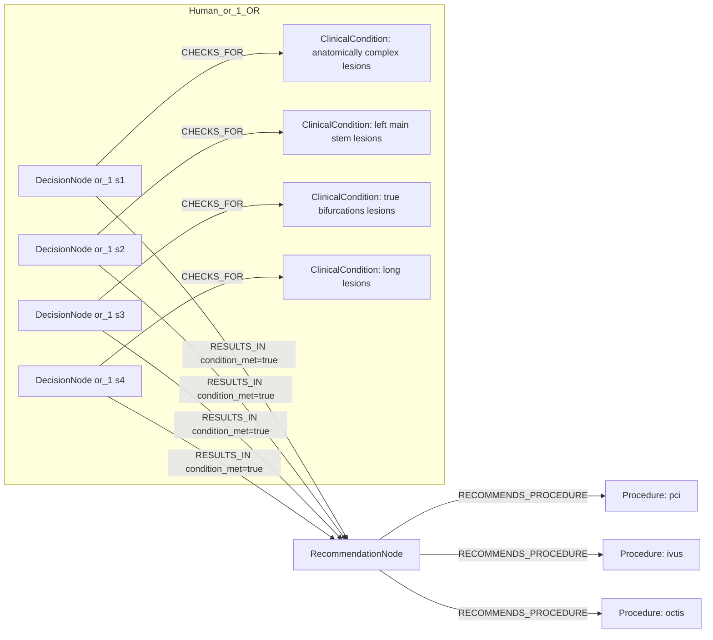
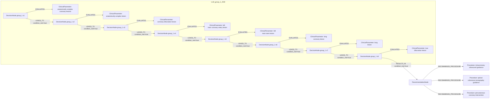

# row_16 (mapped to row_16)

Original table row text (ground truth):

```json
{
  "Recommendations": "Intracoronary imaging guidance by IVUS or OCTis recommended when performing PCI on anatomically complex lesions, in particular left main stem, true bifurcations, and long lesions. 866,337,810,840,841",
  "Class a": "I",
  "Level b": "A"
}
```

Aligned JSON (expected vs actual):

<table>
  <tr>
    <th align="left">Human Annotation</th>
    <th align="left">LLM Generated</th>
  </tr>
  <tr>
    <td valign="top"><pre>
[
  {
    "conditions": [
      {
        "entity": "pci",
        "entity_original": "pci",
        "role": "Procedure",
        "operator": "PRESENT",
        "threshold": null,
        "unit": null,
        "context": null,
        "logic_type": "AND",
        "logic_group": "and_1",
        "strength": null,
        "level": null,
        "direction": null
      },
      {
        "entity": "anatomically complex lesions",
        "entity_original": "anatomically complex lesions",
        "role": "ClinicalCondition",
        "operator": "PRESENT",
        "threshold": null,
        "unit": null,
        "context": null,
        "logic_type": "OR",
        "logic_group": "or_1",
        "strength": null,
        "level": null,
        "direction": null
      },
      {
        "entity": "left main stem lesions",
        "entity_original": "left main stem lesions",
        "role": "ClinicalCondition",
        "operator": "PRESENT",
        "threshold": null,
        "unit": null,
        "context": null,
        "logic_type": "OR",
        "logic_group": "or_1",
        "strength": null,
        "level": null,
        "direction": null
      },
      {
        "entity": "true bifurcations lesions",
        "entity_original": "true bifurcations lesions",
        "role": "ClinicalCondition",
        "operator": "PRESENT",
        "threshold": null,
        "unit": null,
        "context": null,
        "logic_type": "OR",
        "logic_group": "or_1",
        "strength": null,
        "level": null,
        "direction": null
      },
      {
        "entity": "long lesions",
        "entity_original": "long lesions",
        "role": "ClinicalCondition",
        "operator": "PRESENT",
        "threshold": null,
        "unit": null,
        "context": null,
        "logic_type": "OR",
        "logic_group": "or_1",
        "strength": null,
        "level": null,
        "direction": null
      }
    ],
    "actions": [
      {
        "entity": "ivus",
        "entity_original": "intracoronary imaging guidance by ivus recommended",
        "role": "Procedure",
        "operator": null,
        "threshold": null,
        "unit": null,
        "context": null,
        "logic_type": null,
        "logic_group": null,
        "strength": "I",
        "level": "A",
        "direction": "POSITIVE"
      },
      {
        "entity": "octis",
        "entity_original": "intracoronary imaging guidance by octis recommended",
        "role": "Procedure",
        "operator": null,
        "threshold": null,
        "unit": null,
        "context": null,
        "logic_type": null,
        "logic_group": null,
        "strength": "I",
        "level": "A",
        "direction": "POSITIVE"
      }
    ]
  }
]
</pre></td>
    <td valign="top"><pre>
{
  "rules": [
    {
      "conditions": [
        {
          "entity": "anatomically complex coronary lesions",
          "entity_original": "anatomically complex lesions",
          "role": "ClinicalParameter",
          "operator": "PRESENT",
          "threshold": null,
          "unit": null,
          "context": null,
          "logic_type": null,
          "logic_group": null,
          "strength": null,
          "level": null,
          "direction": "POSITIVE",
          "preferred_term": null,
          "synonyms": [],
          "snomed_id": null,
          "target_label": "ClinicalParameter",
          "taxonomy_path": [],
          "root_concept_id": null,
          "root_concept_term": null
        },
        {
          "entity": "left main coronary artery lesion",
          "entity_original": "left main stem",
          "role": "ClinicalParameter",
          "operator": "PRESENT",
          "threshold": null,
          "unit": null,
          "context": null,
          "logic_type": null,
          "logic_group": null,
          "strength": null,
          "level": null,
          "direction": "POSITIVE",
          "preferred_term": null,
          "synonyms": [],
          "snomed_id": null,
          "target_label": "ClinicalParameter",
          "taxonomy_path": [],
          "root_concept_id": null,
          "root_concept_term": null
        },
        {
          "entity": "coronary bifurcation lesion",
          "entity_original": "true bifurcations",
          "role": "ClinicalParameter",
          "operator": "PRESENT",
          "threshold": null,
          "unit": null,
          "context": null,
          "logic_type": null,
          "logic_group": null,
          "strength": null,
          "level": null,
          "direction": "POSITIVE",
          "preferred_term": null,
          "synonyms": [],
          "snomed_id": null,
          "target_label": "ClinicalParameter",
          "taxonomy_path": [],
          "root_concept_id": null,
          "root_concept_term": null
        },
        {
          "entity": "anatomically complex lesion",
          "entity_original": "anatomically complex lesions",
          "role": "ClinicalParameter",
          "operator": "PRESENT",
          "threshold": null,
          "unit": null,
          "context": null,
          "logic_type": null,
          "logic_group": null,
          "strength": "Unknown",
          "level": "Unknown",
          "direction": null,
          "preferred_term": "Lumbosacral plexus lesion (disorder)",
          "synonyms": [
            "Lumbosacral plexus lesion"
          ],
          "snomed_id": 4062006,
          "target_label": "ClinicalCondition",
          "taxonomy_path": [
            {
              "concept_id": "4062006",
              "term": "Lumbosacral plexus lesion (disorder)"
            },
            {
              "concept_id": "239953001",
              "term": "Lesion of soft tissue (disorder)"
            },
            {
              "concept_id": "19660004",
              "term": "Disorder of soft tissue (disorder)"
            },
            {
              "concept_id": "64572001",
              "term": "Disease (disorder)"
            },
            {
              "concept_id": "404684003",
              "term": "Clinical finding (finding)"
            },
            {
              "concept_id": "138875005",
              "term": "SNOMED CT Concept (SNOMED RT+CTV3)"
            }
          ],
          "root_concept_id": "404684003",
          "root_concept_term": "Clinical finding (finding)"
        }
      ],
      "actions": [
        {
          "entity": "percutaneous coronary intervention",
          "entity_original": "pci",
          "role": "Procedure",
          "operator": "PLANNED",
          "threshold": null,
          "unit": null,
          "context": null,
          "logic_type": null,
          "logic_group": null,
          "strength": "Class I",
          "level": "A",
          "direction": "POSITIVE",
          "preferred_term": "Percutaneous transluminal coronary intervention using imaging guidance with contrast (procedure)",
          "synonyms": [],
          "snomed_id": 415070008,
          "target_label": "Procedure",
          "taxonomy_path": [
            {
              "concept_id": "415070008",
              "term": "Percutaneous transluminal coronary intervention using imaging guidance with contrast (procedure)"
            },
            {
              "concept_id": "4365001",
              "term": "Surgical repair (procedure)"
            },
            {
              "concept_id": "128927009",
              "term": "Procedure by method (procedure)"
            },
            {
              "concept_id": "71388002",
              "term": "Procedure (procedure)"
            }
          ],
          "root_concept_id": "71388002",
          "root_concept_term": "Procedure (procedure)"
        },
        {
          "entity": "intracoronary ultrasound guidance",
          "entity_original": "intracoronary imaging guidance by ivus or oct",
          "role": "Procedure",
          "operator": "PRESENT",
          "threshold": null,
          "unit": null,
          "context": null,
          "logic_type": null,
          "logic_group": null,
          "strength": "Class I",
          "level": "A",
          "direction": "POSITIVE",
          "preferred_term": null,
          "synonyms": [],
          "snomed_id": null,
          "target_label": "Procedure",
          "taxonomy_path": [],
          "root_concept_id": null,
          "root_concept_term": null
        },
        {
          "entity": "optical coherence tomography guidance",
          "entity_original": "intracoronary imaging guidance by ivus or oct",
          "role": "Procedure",
          "operator": "PRESENT",
          "threshold": null,
          "unit": null,
          "context": null,
          "logic_type": null,
          "logic_group": null,
          "strength": "Class I",
          "level": "A",
          "direction": "POSITIVE",
          "preferred_term": "Optical coherence tomography (procedure)",
          "synonyms": [
            "Optical coherence tomography",
            "OCT - Optical coherence tomography"
          ],
          "snomed_id": 392010000,
          "target_label": "Procedure",
          "taxonomy_path": [
            {
              "concept_id": "392010000",
              "term": "Optical coherence tomography (procedure)"
            },
            {
              "concept_id": "371575001",
              "term": "Tomographic imaging procedure (procedure)"
            },
            {
              "concept_id": "363680008",
              "term": "Radiographic imaging procedure (procedure)"
            },
            {
              "concept_id": "363679005",
              "term": "Imaging (procedure)"
            },
            {
              "concept_id": "386053000",
              "term": "Evaluation procedure (procedure)"
            },
            {
              "concept_id": "128927009",
              "term": "Procedure by method (procedure)"
            },
            {
              "concept_id": "71388002",
              "term": "Procedure (procedure)"
            },
            {
              "concept_id": "138875005",
              "term": "SNOMED CT Concept (SNOMED RT+CTV3)"
            }
          ],
          "root_concept_id": "71388002",
          "root_concept_term": "Procedure (procedure)"
        }
      ]
    }
  ]
}
</pre></td>
  </tr>
</table>

Mermaid (Human Annotation):



Mermaid (LLM Generated):



Grounding summary (optional):

```json
{
  "enabled": true,
  "total_grounded": 7,
  "target_label_counts": {
    "ClinicalParameter": 3,
    "Procedure": 3,
    "ClinicalCondition": 1
  },
  "root_hit_counts": {
    "71388002": 2,
    "404684003": 1
  },
  "root_hits": [
    {
      "entity": "Anatomically complex coronary lesions",
      "entity_original": "anatomically complex lesions",
      "role": "ClinicalParameter",
      "preferred_term": null,
      "synonyms": [],
      "snomed_id": null,
      "target_label": "ClinicalParameter",
      "taxonomy_path": [],
      "root_hit": null
    },
    {
      "entity": "Left main coronary artery lesion",
      "entity_original": "left main stem",
      "role": "ClinicalParameter",
      "preferred_term": null,
      "synonyms": [],
      "snomed_id": null,
      "target_label": "ClinicalParameter",
      "taxonomy_path": [],
      "root_hit": null
    },
    {
      "entity": "Coronary bifurcation lesion",
      "entity_original": "true bifurcations",
      "role": "ClinicalParameter",
      "preferred_term": null,
      "synonyms": [],
      "snomed_id": null,
      "target_label": "ClinicalParameter",
      "taxonomy_path": [],
      "root_hit": null
    },
    {
      "entity": "Percutaneous coronary intervention",
      "entity_original": "PCI",
      "role": "Procedure",
      "preferred_term": "Percutaneous transluminal coronary intervention using imaging guidance with contrast (procedure)",
      "synonyms": [],
      "snomed_id": 415070008,
      "target_label": "Procedure",
      "taxonomy_path": [
        {
          "concept_id": "415070008",
          "term": "Percutaneous transluminal coronary intervention using imaging guidance with contrast (procedure)"
        },
        {
          "concept_id": "4365001",
          "term": "Surgical repair (procedure)"
        },
        {
          "concept_id": "128927009",
          "term": "Procedure by method (procedure)"
        },
        {
          "concept_id": "71388002",
          "term": "Procedure (procedure)"
        }
      ],
      "root_hit": {
        "root_concept_id": "71388002",
        "root_concept_term": "Procedure (procedure)",
        "mapped_target_label": "Procedure"
      }
    },
    {
      "entity": "Intracoronary ultrasound guidance",
      "entity_original": "Intracoronary imaging guidance by IVUS or OCT",
      "role": "Procedure",
      "preferred_term": null,
      "synonyms": [],
      "snomed_id": null,
      "target_label": "Procedure",
      "taxonomy_path": [],
      "root_hit": null
    },
    {
      "entity": "Optical coherence tomography guidance",
      "entity_original": "Intracoronary imaging guidance by IVUS or OCT",
      "role": "Procedure",
      "preferred_term": "Optical coherence tomography (procedure)",
      "synonyms": [
        "Optical coherence tomography",
        "OCT - Optical coherence tomography"
      ],
      "snomed_id": 392010000,
      "target_label": "Procedure",
      "taxonomy_path": [
        {
          "concept_id": "392010000",
          "term": "Optical coherence tomography (procedure)"
        },
        {
          "concept_id": "371575001",
          "term": "Tomographic imaging procedure (procedure)"
        },
        {
          "concept_id": "363680008",
          "term": "Radiographic imaging procedure (procedure)"
        },
        {
          "concept_id": "363679005",
          "term": "Imaging (procedure)"
        },
        {
          "concept_id": "386053000",
          "term": "Evaluation procedure (procedure)"
        },
        {
          "concept_id": "128927009",
          "term": "Procedure by method (procedure)"
        },
        {
          "concept_id": "71388002",
          "term": "Procedure (procedure)"
        },
        {
          "concept_id": "138875005",
          "term": "SNOMED CT Concept (SNOMED RT+CTV3)"
        }
      ],
      "root_hit": {
        "root_concept_id": "71388002",
        "root_concept_term": "Procedure (procedure)",
        "mapped_target_label": "Procedure"
      }
    },
    {
      "entity": "Anatomically complex lesion",
      "entity_original": "anatomically complex lesions",
      "role": "ClinicalParameter",
      "preferred_term": "Lumbosacral plexus lesion (disorder)",
      "synonyms": [
        "Lumbosacral plexus lesion"
      ],
      "snomed_id": 4062006,
      "target_label": "ClinicalCondition",
      "taxonomy_path": [
        {
          "concept_id": "4062006",
          "term": "Lumbosacral plexus lesion (disorder)"
        },
        {
          "concept_id": "239953001",
          "term": "Lesion of soft tissue (disorder)"
        },
        {
          "concept_id": "19660004",
          "term": "Disorder of soft tissue (disorder)"
        },
        {
          "concept_id": "64572001",
          "term": "Disease (disorder)"
        },
        {
          "concept_id": "404684003",
          "term": "Clinical finding (finding)"
        },
        {
          "concept_id": "138875005",
          "term": "SNOMED CT Concept (SNOMED RT+CTV3)"
        }
      ],
      "root_hit": {
        "root_concept_id": "404684003",
        "root_concept_term": "Clinical finding (finding)",
        "mapped_target_label": "ClinicalCondition"
      }
    }
  ]
}
```

Concepts:
- expected: 7
- actual: 11
- matches: 0
- missing: 7
- extra: 11

Missing concepts:
- ClinicalCondition: anatomically complex lesions
- ClinicalCondition: left main stem lesions
- ClinicalCondition: long lesions
- ClinicalCondition: true bifurcations lesions
- Procedure: ivus
- Procedure: octis
- Procedure: pci

Extra concepts:
- ClinicalParameter: anatomically complex coronary lesions
- ClinicalParameter: anatomically complex lesion
- ClinicalParameter: coronary bifurcation lesion
- ClinicalParameter: left main coronary artery lesion
- ClinicalParameter: left main stem lesion
- ClinicalParameter: long coronary lesion
- ClinicalParameter: long lesion
- ClinicalParameter: true bifurcation lesion
- Procedure: intracoronary ultrasound guidance
- Procedure: optical coherence tomography guidance
- Procedure: percutaneous coronary intervention

Rules (concept + logic fields):
- expected: 7
- actual: 11
- matches: 0
- missing: 7
- extra: 11

Missing rules:
- ClinicalCondition: anatomically complex lesions | op=PRESENT | logic=OR | grp=or_1
- ClinicalCondition: left main stem lesions | op=PRESENT | logic=OR | grp=or_1
- ClinicalCondition: long lesions | op=PRESENT | logic=OR | grp=or_1
- ClinicalCondition: true bifurcations lesions | op=PRESENT | logic=OR | grp=or_1
- Procedure: ivus | class=I | level=A | dir=POSITIVE
- Procedure: octis | class=I | level=A | dir=POSITIVE
- Procedure: pci | op=PRESENT | logic=AND | grp=and_1

Extra rules:
- ClinicalParameter: anatomically complex coronary lesions | op=PRESENT | dir=POSITIVE
- ClinicalParameter: anatomically complex lesion | op=PRESENT | class=Unknown | level=Unknown
- ClinicalParameter: coronary bifurcation lesion | op=PRESENT | dir=POSITIVE
- ClinicalParameter: left main coronary artery lesion | op=PRESENT | dir=POSITIVE
- ClinicalParameter: left main stem lesion | op=PRESENT | class=Unknown | level=Unknown
- ClinicalParameter: long coronary lesion | op=PRESENT | dir=POSITIVE
- ClinicalParameter: long lesion | op=PRESENT | class=Unknown | level=Unknown
- ClinicalParameter: true bifurcation lesion | op=PRESENT | class=Unknown | level=Unknown
- Procedure: intracoronary ultrasound guidance | op=PRESENT | class=Class I | level=A | dir=POSITIVE
- Procedure: optical coherence tomography guidance | op=PRESENT | class=Class I | level=A | dir=POSITIVE
- Procedure: percutaneous coronary intervention | op=PLANNED | class=Class I | level=A | dir=POSITIVE

