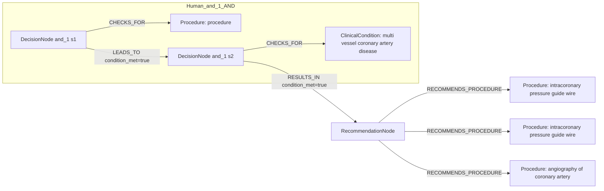

# row_17 (mapped to row_18)

Original table row text (ground truth):

```json
{
  "Recommendations": "\u2022 is recommended to guide lesion selection for intervention in patients with multivessel disease; 308,826,866,867",
  "Class a": "I",
  "Level b": "A"
}
```

Aligned JSON (expected vs actual):

<table>
  <tr>
    <th align="left">Human Annotation</th>
    <th align="left">LLM Generated</th>
  </tr>
  <tr>
    <td valign="top"><pre>
[
  {
    "conditions": [
      {
        "entity": "procedure",
        "entity_original": "intervention",
        "role": "Procedure",
        "operator": "PRESENT",
        "threshold": null,
        "unit": null,
        "context": null,
        "logic_type": "AND",
        "logic_group": "and_1",
        "strength": null,
        "level": null,
        "direction": null
      },
      {
        "entity": "multi vessel coronary artery disease",
        "entity_original": "patients with multivessel disease",
        "role": "ClinicalCondition",
        "operator": "PRESENT",
        "threshold": null,
        "unit": null,
        "context": null,
        "logic_type": "AND",
        "logic_group": "and_1",
        "strength": null,
        "level": null,
        "direction": null
      }
    ],
    "actions": [
      {
        "entity": "intracoronary pressure guide wire",
        "entity_original": "intracoronary pressure measurement (ffr)",
        "role": "Procedure",
        "operator": null,
        "threshold": null,
        "unit": null,
        "context": null,
        "logic_type": null,
        "logic_group": null,
        "strength": "I",
        "level": "A",
        "direction": "POSITIVE"
      },
      {
        "entity": "intracoronary pressure guide wire",
        "entity_original": "intracoronary pressure measurement (ifr)",
        "role": "Procedure",
        "operator": null,
        "threshold": null,
        "unit": null,
        "context": null,
        "logic_type": null,
        "logic_group": null,
        "strength": "I",
        "level": "A",
        "direction": "POSITIVE"
      },
      {
        "entity": "angiography of coronary artery",
        "entity_original": "computation (qfr)",
        "role": "Procedure",
        "operator": null,
        "threshold": null,
        "unit": null,
        "context": null,
        "logic_type": null,
        "logic_group": null,
        "strength": "I",
        "level": "A",
        "direction": "POSITIVE"
      }
    ]
  }
]
</pre></td>
    <td valign="top"><pre>
{
  "rules": [
    {
      "conditions": [],
      "actions": []
    }
  ]
}
</pre></td>
  </tr>
</table>

Mermaid (Human Annotation):



Mermaid (LLM Generated):


Concepts:
- expected: 4
- actual: 11
- matches: 0
- missing: 4
- extra: 11

Missing concepts:
- ClinicalCondition: multi vessel coronary artery disease
- Procedure: angiography of coronary artery
- Procedure: intracoronary pressure guide wire
- Procedure: procedure

Extra concepts:
- Condition: age
- Condition: cognitive status
- Condition: diabetes
- Condition: frailty
- Condition: high anatomical complexity
- Condition: left main stem involvement
- Condition: likelihood of revascularization completeness
- Condition: local expertise and outcomes
- Condition: multivessel disease
- Condition: other comorbidities
- Procedure: assessment of procedural risks and post-procedural outcomes

Rules (concept + logic fields):
- expected: 4
- actual: 11
- matches: 0
- missing: 4
- extra: 11

Missing rules:
- ClinicalCondition: multi vessel coronary artery disease | op=PRESENT | logic=AND | grp=and_1
- Procedure: angiography of coronary artery | class=I | level=A | dir=POSITIVE
- Procedure: intracoronary pressure guide wire | class=I | level=A | dir=POSITIVE
- Procedure: procedure | op=PRESENT | logic=AND | grp=and_1

Extra rules:
- Condition: age | op=PRESENT | logic=AND | grp=and_1 | dir=UNKNOWN
- Condition: cognitive status | op=PRESENT | logic=AND | grp=and_3 | dir=UNKNOWN
- Condition: diabetes | op=PRESENT | logic=AND | grp=and_4 | dir=UNKNOWN
- Condition: frailty | op=PRESENT | logic=AND | grp=and_2 | dir=UNKNOWN
- Condition: high anatomical complexity | op=PRESENT | logic=AND | grp=and_8 | dir=UNKNOWN
- Condition: left main stem involvement | op=PRESENT | logic=AND | grp=and_7 | dir=UNKNOWN
- Condition: likelihood of revascularization completeness | op=PRESENT | logic=AND | grp=and_9 | dir=UNKNOWN
- Condition: local expertise and outcomes | op=PRESENT | logic=AND | grp=and_10 | dir=UNKNOWN
- Condition: multivessel disease | op=PRESENT | logic=AND | grp=and_6 | dir=UNKNOWN
- Condition: other comorbidities | op=PRESENT | logic=AND | grp=and_5 | dir=UNKNOWN
- Procedure: assessment of procedural risks and post-procedural outcomes | dir=POSITIVE

