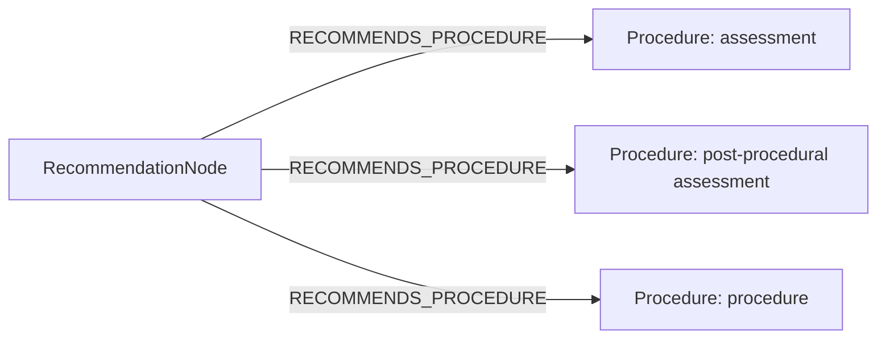

# row_18 (mapped to row_18)

Original table row text (ground truth):

```json
{
  "Recommendations": "\u2022 should be considered at the end of the procedure to identify patients at high risk of persistent angina and subsequent clinical events; 828,830,831,868",
  "Class a": "IIa",
  "Level b": "B"
}
```

Aligned JSON (expected vs actual):

<table>
  <tr>
    <th align="left">Human Annotation</th>
    <th align="left">LLM Generated</th>
  </tr>
  <tr>
    <td valign="top"><pre>
[
  {
    "conditions": [
      {
        "entity": "revascularization",
        "entity_original": "at the end of the revascularization",
        "role": "Procedure",
        "operator": "PRESENT",
        "threshold": null,
        "unit": null,
        "context": null,
        "logic_type": "AND",
        "logic_group": "and_1",
        "strength": null,
        "level": null,
        "direction": null
      },
      {
        "entity": "chronic coronary syndrome",
        "entity_original": "patients with chronic coronary syndrome",
        "role": "ClinicalCondition",
        "operator": "PRESENT",
        "threshold": null,
        "unit": null,
        "context": null,
        "logic_type": "AND",
        "logic_group": "and_1",
        "strength": null,
        "level": null,
        "direction": null
      }
    ],
    "actions": [
      {
        "entity": "intracoronary pressure measurement (ffr)",
        "entity_original": "intracoronary pressure measurement (ffr) is recommended to identify patients at high risk of persistent angina and subsequent clinical events",
        "role": "Procedure",
        "operator": null,
        "threshold": null,
        "unit": null,
        "context": null,
        "logic_type": null,
        "logic_group": null,
        "strength": "IIa",
        "level": "B",
        "direction": "POSITIVE"
      },
      {
        "entity": "intracoronary pressure measurement (ifr)",
        "entity_original": "intracoronary pressure measurement (ifr) is recommended to identify patients at high risk of persistent angina and subsequent clinical events",
        "role": "Procedure",
        "operator": null,
        "threshold": null,
        "unit": null,
        "context": null,
        "logic_type": null,
        "logic_group": null,
        "strength": "IIa",
        "level": "B",
        "direction": "POSITIVE"
      },
      {
        "entity": "computation (qfr)",
        "entity_original": "computation (qfr) is recommended to identify patients at high risk of persistent angina and subsequent clinical events",
        "role": "Procedure",
        "operator": null,
        "threshold": null,
        "unit": null,
        "context": null,
        "logic_type": null,
        "logic_group": null,
        "strength": "IIa",
        "level": "B",
        "direction": "POSITIVE"
      }
    ]
  }
]
</pre></td>
    <td valign="top"><pre>
{
  "rules": [
    {
      "conditions": [],
      "actions": [
        {
          "entity": "procedure",
          "entity_original": "end of the procedure",
          "role": "Procedure",
          "operator": "PRESENT",
          "threshold": null,
          "unit": null,
          "context": null,
          "logic_type": null,
          "logic_group": null,
          "strength": "Class IIa",
          "level": "B",
          "direction": "POSITIVE",
          "preferred_term": null,
          "synonyms": [],
          "snomed_id": null,
          "target_label": "Procedure",
          "taxonomy_path": [],
          "root_concept_id": null,
          "root_concept_term": null
        },
        {
          "entity": "assessment",
          "entity_original": "should be considered",
          "role": "Procedure",
          "operator": "PRESENT",
          "threshold": null,
          "unit": null,
          "context": null,
          "logic_type": null,
          "logic_group": null,
          "strength": "Class IIa",
          "level": "B",
          "direction": "POSITIVE",
          "preferred_term": "Physical assessment (procedure)",
          "synonyms": [
            "Physical assessment"
          ],
          "snomed_id": 81375008,
          "target_label": "Procedure",
          "taxonomy_path": [
            {
              "concept_id": "81375008",
              "term": "Physical assessment (procedure)"
            },
            {
              "concept_id": "386053000",
              "term": "Evaluation procedure (procedure)"
            },
            {
              "concept_id": "128927009",
              "term": "Procedure by method (procedure)"
            },
            {
              "concept_id": "71388002",
              "term": "Procedure (procedure)"
            },
            {
              "concept_id": "138875005",
              "term": "SNOMED CT Concept (SNOMED RT+CTV3)"
            }
          ],
          "root_concept_id": "71388002",
          "root_concept_term": "Procedure (procedure)"
        }
      ]
    }
  ]
}
</pre></td>
  </tr>
</table>

Mermaid (Human Annotation):

```mermaid
graph LR
  REC[RecommendationNode]
  ACT1[Procedure: revascularization]
  REC -->|RECOMMENDS_PROCEDURE| ACT1
  ACT2[Procedure: intracoronary pressure measurement (ffr)]
  REC -->|RECOMMENDS_PROCEDURE| ACT2
  ACT3[Procedure: intracoronary pressure measurement (ifr)]
  REC -->|RECOMMENDS_PROCEDURE| ACT3
  ACT4[Procedure: computation (qfr)]
  REC -->|RECOMMENDS_PROCEDURE| ACT4
  subgraph Human_and_1_AND
    D_and_1_1[DecisionNode and_1 s1]
    C_and_1_1[ClinicalCondition: chronic coronary syndrome]
    D_and_1_1 -->|CHECKS_FOR| C_and_1_1
  end
  D_and_1_1 -->|RESULTS_IN condition_met=true| REC
```

Mermaid (LLM Generated):



Grounding summary (optional):

```json
{
  "enabled": true,
  "total_grounded": 2,
  "target_label_counts": {
    "Procedure": 2
  },
  "root_hit_counts": {
    "71388002": 1
  },
  "root_hits": [
    {
      "entity": "Procedure",
      "entity_original": "end of the procedure",
      "role": "Procedure",
      "preferred_term": null,
      "synonyms": [],
      "snomed_id": null,
      "target_label": "Procedure",
      "taxonomy_path": [],
      "root_hit": null
    },
    {
      "entity": "Assessment",
      "entity_original": "should be considered",
      "role": "Procedure",
      "preferred_term": "Physical assessment (procedure)",
      "synonyms": [
        "Physical assessment"
      ],
      "snomed_id": 81375008,
      "target_label": "Procedure",
      "taxonomy_path": [
        {
          "concept_id": "81375008",
          "term": "Physical assessment (procedure)"
        },
        {
          "concept_id": "386053000",
          "term": "Evaluation procedure (procedure)"
        },
        {
          "concept_id": "128927009",
          "term": "Procedure by method (procedure)"
        },
        {
          "concept_id": "71388002",
          "term": "Procedure (procedure)"
        },
        {
          "concept_id": "138875005",
          "term": "SNOMED CT Concept (SNOMED RT+CTV3)"
        }
      ],
      "root_hit": {
        "root_concept_id": "71388002",
        "root_concept_term": "Procedure (procedure)",
        "mapped_target_label": "Procedure"
      }
    }
  ]
}
```

Concepts:
- expected: 5
- actual: 3
- matches: 0
- missing: 5
- extra: 3

Missing concepts:
- ClinicalCondition: chronic coronary syndrome
- Procedure: computation (qfr)
- Procedure: intracoronary pressure measurement (ffr)
- Procedure: intracoronary pressure measurement (ifr)
- Procedure: revascularization

Extra concepts:
- Procedure: assessment
- Procedure: post-procedural assessment
- Procedure: procedure

Rules (concept + logic fields):
- expected: 5
- actual: 3
- matches: 0
- missing: 5
- extra: 3

Missing rules:
- ClinicalCondition: chronic coronary syndrome | op=PRESENT | logic=AND | grp=and_1
- Procedure: computation (qfr) | class=IIa | level=B | dir=POSITIVE
- Procedure: intracoronary pressure measurement (ffr) | class=IIa | level=B | dir=POSITIVE
- Procedure: intracoronary pressure measurement (ifr) | class=IIa | level=B | dir=POSITIVE
- Procedure: revascularization | op=PRESENT | logic=AND | grp=and_1

Extra rules:
- Procedure: assessment | op=PRESENT | class=Class IIa | level=B | dir=POSITIVE
- Procedure: post-procedural assessment | op=PLANNED | class=Unknown | level=Unknown
- Procedure: procedure | op=PRESENT | class=Class IIa | level=B | dir=POSITIVE

