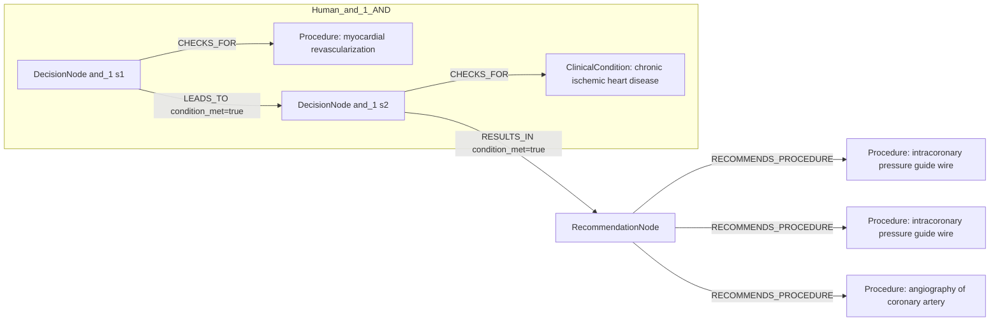
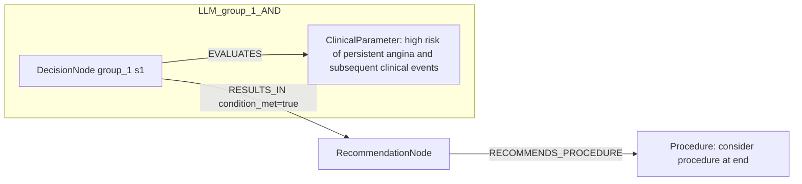

# row_18 (mapped to row_18)

Original table row text (ground truth):

```json
{
  "Recommendations": "\u2022 should be considered at the end of the procedure to identify patients at high risk of persistent angina and subsequent clinical events; 828,830,831,868",
  "Class a": "IIa",
  "Level b": "B"
}
```

Aligned JSON (expected vs actual):

<table>
  <tr>
    <th align="left">Human Annotation</th>
    <th align="left">LLM Generated</th>
  </tr>
  <tr>
    <td valign="top"><pre>
[
  {
    "conditions": [
      {
        "entity": "myocardial revascularization",
        "entity_original": "at the end of the revascularization",
        "role": "Procedure",
        "operator": "PRESENT",
        "threshold": null,
        "unit": null,
        "context": null,
        "logic_type": "AND",
        "logic_group": "and_1",
        "strength": null,
        "level": null,
        "direction": null,
        "preferred_term": null,
        "synonyms": [],
        "snomed_id": "275227003",
        "target_label": null,
        "taxonomy_path": [],
        "root_concept_id": null,
        "root_concept_term": null
      },
      {
        "entity": "chronic ischemic heart disease",
        "entity_original": "patients with chronic coronary syndrome",
        "role": "ClinicalCondition",
        "operator": "PRESENT",
        "threshold": null,
        "unit": null,
        "context": null,
        "logic_type": "AND",
        "logic_group": "and_1",
        "strength": null,
        "level": null,
        "direction": null,
        "preferred_term": null,
        "synonyms": [],
        "snomed_id": "413838009",
        "target_label": null,
        "taxonomy_path": [],
        "root_concept_id": null,
        "root_concept_term": null
      }
    ],
    "actions": [
      {
        "entity": "intracoronary pressure guide wire",
        "entity_original": "intracoronary pressure measurement (ffr)",
        "role": "Procedure",
        "operator": null,
        "threshold": null,
        "unit": null,
        "context": null,
        "logic_type": null,
        "logic_group": null,
        "strength": "IIa",
        "level": "B",
        "direction": "POSITIVE",
        "preferred_term": null,
        "synonyms": [],
        "snomed_id": "371789009",
        "target_label": null,
        "taxonomy_path": [],
        "root_concept_id": null,
        "root_concept_term": null
      },
      {
        "entity": "intracoronary pressure guide wire",
        "entity_original": "intracoronary pressure measurement (ifr)",
        "role": "Procedure",
        "operator": null,
        "threshold": null,
        "unit": null,
        "context": null,
        "logic_type": null,
        "logic_group": null,
        "strength": "IIa",
        "level": "B",
        "direction": "POSITIVE",
        "preferred_term": null,
        "synonyms": [],
        "snomed_id": "371789009",
        "target_label": null,
        "taxonomy_path": [],
        "root_concept_id": null,
        "root_concept_term": null
      },
      {
        "entity": "angiography of coronary artery",
        "entity_original": "computation (qfr)",
        "role": "Procedure",
        "operator": null,
        "threshold": null,
        "unit": null,
        "context": null,
        "logic_type": null,
        "logic_group": null,
        "strength": "IIa",
        "level": "B",
        "direction": "POSITIVE",
        "preferred_term": null,
        "synonyms": [],
        "snomed_id": "33367005",
        "target_label": null,
        "taxonomy_path": [],
        "root_concept_id": null,
        "root_concept_term": null
      }
    ]
  }
]
</pre></td>
    <td valign="top"><pre>
{
  "rules": [
    {
      "conditions": [
        {
          "entity": "high risk of persistent angina and subsequent clinical events",
          "entity_original": "high risk of persistent angina and subsequent clinical events",
          "role": "ClinicalParameter",
          "operator": "PRESENT",
          "threshold": null,
          "unit": null,
          "context": null,
          "logic_type": null,
          "logic_group": null,
          "strength": "Class IIa",
          "level": "B",
          "direction": "POSITIVE",
          "preferred_term": null,
          "synonyms": [],
          "snomed_id": null,
          "target_label": "ClinicalParameter",
          "taxonomy_path": [],
          "root_concept_id": null,
          "root_concept_term": null
        }
      ],
      "actions": [
        {
          "entity": "consider procedure at end",
          "entity_original": "should be considered at the end of the procedure",
          "role": "Procedure",
          "operator": "PLANNED",
          "threshold": null,
          "unit": null,
          "context": null,
          "logic_type": null,
          "logic_group": null,
          "strength": "Class IIa",
          "level": "B",
          "direction": "POSITIVE",
          "preferred_term": null,
          "synonyms": [],
          "snomed_id": null,
          "target_label": "Procedure",
          "taxonomy_path": [],
          "root_concept_id": null,
          "root_concept_term": null
        }
      ]
    }
  ]
}
</pre></td>
  </tr>
</table>

Mermaid (Human Annotation):



Mermaid (LLM Generated):



Grounding summary (optional):

```json
{
  "enabled": true,
  "total_grounded": 2,
  "target_label_counts": {
    "Procedure": 1,
    "ClinicalParameter": 1
  },
  "root_hit_counts": {},
  "root_hits": [
    {
      "entity": "Consider procedure at end",
      "entity_original": "should be considered at the end of the procedure",
      "role": "Procedure",
      "preferred_term": null,
      "synonyms": [],
      "snomed_id": null,
      "target_label": "Procedure",
      "taxonomy_path": [],
      "root_hit": null
    },
    {
      "entity": "high risk of persistent angina and subsequent clinical events",
      "entity_original": "high risk of persistent angina and subsequent clinical events",
      "role": "ClinicalParameter",
      "preferred_term": null,
      "synonyms": [],
      "snomed_id": null,
      "target_label": "ClinicalParameter",
      "taxonomy_path": [],
      "root_hit": null
    }
  ]
}
```

Concepts:
- expected: 4
- actual: 2
- matches: 0
- missing: 4
- extra: 2

Missing concepts:
- ClinicalCondition: chronic ischemic heart disease
- Procedure: angiography of coronary artery
- Procedure: intracoronary pressure guide wire
- Procedure: myocardial revascularization

Extra concepts:
- ClinicalParameter: high risk of persistent angina and subsequent clinical events
- Procedure: consider procedure at end

Rules (concept + logic fields):
- expected: 4
- actual: 2
- matches: 0
- missing: 4
- extra: 2

Missing rules:
- ClinicalCondition: chronic ischemic heart disease | op=PRESENT | logic=AND | grp=and_1
- Procedure: angiography of coronary artery | class=IIa | level=B | dir=POSITIVE
- Procedure: intracoronary pressure guide wire | class=IIa | level=B | dir=POSITIVE
- Procedure: myocardial revascularization | op=PRESENT | logic=AND | grp=and_1

Extra rules:
- ClinicalParameter: high risk of persistent angina and subsequent clinical events | op=PRESENT | class=Class IIa | level=B | dir=POSITIVE
- Procedure: consider procedure at end | op=PLANNED | class=Class IIa | level=B | dir=POSITIVE

