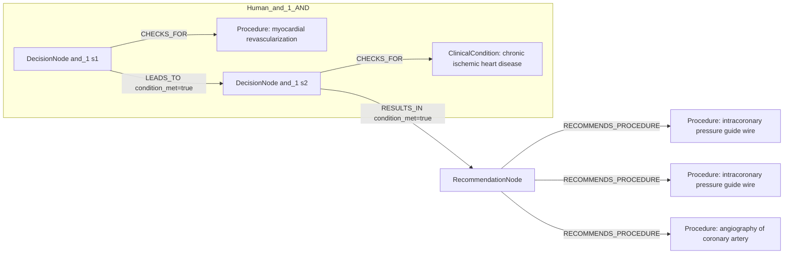

# row_19 (mapped to row_20)

Original table row text (ground truth):

```json
{
  "Recommendations": "\u2022 may be considered at the end of the procedure to identify lesions potentially amenable to treatment with additional PCI. 350,829,831",
  "Class a": "IIb",
  "Level b": "B"
}
```

Aligned JSON (expected vs actual):

<table>
  <tr>
    <th align="left">Human Annotation</th>
    <th align="left">LLM Generated</th>
  </tr>
  <tr>
    <td valign="top"><pre>
[
  {
    "conditions": [
      {
        "entity": "myocardial revascularization",
        "entity_original": "at the end of the revascularization",
        "role": "Procedure",
        "operator": "PRESENT",
        "threshold": null,
        "unit": null,
        "context": null,
        "logic_type": "AND",
        "logic_group": "and_1",
        "strength": null,
        "level": null,
        "direction": null
      },
      {
        "entity": "chronic ischemic heart disease",
        "entity_original": "patients with chronic coronary syndrome",
        "role": "ClinicalCondition",
        "operator": "PRESENT",
        "threshold": null,
        "unit": null,
        "context": null,
        "logic_type": "AND",
        "logic_group": "and_1",
        "strength": null,
        "level": null,
        "direction": null
      }
    ],
    "actions": [
      {
        "entity": "intracoronary pressure guide wire",
        "entity_original": "intracoronary pressure measurement (ffr)",
        "role": "Procedure",
        "operator": null,
        "threshold": null,
        "unit": null,
        "context": null,
        "logic_type": null,
        "logic_group": null,
        "strength": "IIb",
        "level": "B",
        "direction": "POSITIVE"
      },
      {
        "entity": "intracoronary pressure guide wire",
        "entity_original": "intracoronary pressure measurement (ifr)",
        "role": "Procedure",
        "operator": null,
        "threshold": null,
        "unit": null,
        "context": null,
        "logic_type": null,
        "logic_group": null,
        "strength": "IIb",
        "level": "B",
        "direction": "POSITIVE"
      },
      {
        "entity": "angiography of coronary artery",
        "entity_original": "computation (qfr)",
        "role": "Procedure",
        "operator": null,
        "threshold": null,
        "unit": null,
        "context": null,
        "logic_type": null,
        "logic_group": null,
        "strength": "IIb",
        "level": "B",
        "direction": "POSITIVE"
      }
    ]
  }
]
</pre></td>
    <td valign="top"><pre>
{
  "rules": [
    {
      "conditions": [],
      "actions": []
    }
  ]
}
</pre></td>
  </tr>
</table>

Mermaid (Human Annotation):



Mermaid (LLM Generated):


Concepts:
- expected: 4
- actual: 3
- matches: 0
- missing: 4
- extra: 3

Missing concepts:
- ClinicalCondition: chronic ischemic heart disease
- Procedure: angiography of coronary artery
- Procedure: intracoronary pressure guide wire
- Procedure: myocardial revascularization

Extra concepts:
- ClinicalParameter: coronary artery bypass grafting
- Condition: patients undergoing coronary artery bypass grafting (cabg)
- Procedure: society of thoracic surgeons score

Rules (concept + logic fields):
- expected: 4
- actual: 3
- matches: 0
- missing: 4
- extra: 3

Missing rules:
- ClinicalCondition: chronic ischemic heart disease | op=PRESENT | logic=AND | grp=and_1
- Procedure: angiography of coronary artery | class=IIb | level=B | dir=POSITIVE
- Procedure: intracoronary pressure guide wire | class=IIb | level=B | dir=POSITIVE
- Procedure: myocardial revascularization | op=PRESENT | logic=AND | grp=and_1

Extra rules:
- ClinicalParameter: coronary artery bypass grafting | op=PRESENT | logic=AND | grp=and_1 | class=Class I | level=B | dir=POSITIVE
- Condition: patients undergoing coronary artery bypass grafting (cabg) | op=PRESENT | logic=AND | grp=and_1 | class=Class I | level=B | dir=UNKNOWN
- Procedure: society of thoracic surgeons score | op=PRESENT | class=Class I | level=B | dir=POSITIVE

