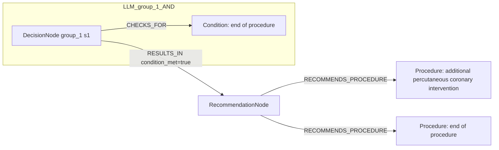

# row_19 (mapped to row_19)

Original table row text (ground truth):

```json
{
  "Recommendations": "\u2022 may be considered at the end of the procedure to identify lesions potentially amenable to treatment with additional PCI. 350,829,831",
  "Class a": "IIb",
  "Level b": "B"
}
```

Aligned JSON (expected vs actual):

<table>
  <tr>
    <th align="left">Human Annotation</th>
    <th align="left">LLM Generated</th>
  </tr>
  <tr>
    <td valign="top"><pre>
[
  {
    "rule_id": 1,
    "conditions": [
      {
        "entity": "revascularization",
        "entity_original": "at the end of the revascularization",
        "role": "Procedure",
        "operator": "PRESENT",
        "threshold": null,
        "unit": null,
        "condition_context": null,
        "logic_type": "AND",
        "logic_group": "and_1",
        "strength": null,
        "level": null,
        "direction": null
      },
      {
        "entity": "chronic coronary syndrome",
        "entity_original": "patients with chronic coronary syndrome",
        "role": "Condition",
        "operator": "PRESENT",
        "threshold": null,
        "unit": null,
        "condition_context": null,
        "logic_type": "AND",
        "logic_group": "and_1",
        "strength": null,
        "level": null,
        "direction": null
      }
    ],
    "actions": [
      {
        "entity": "intracoronary pressure measurement (ffr)",
        "entity_original": "intracoronary pressure measurement (ffr) is recommended to identify lesions potentially amenable to treatment with additional pci",
        "role": "Procedure",
        "operator": null,
        "threshold": null,
        "unit": null,
        "condition_context": null,
        "logic_type": null,
        "logic_group": null,
        "strength": "IIb",
        "level": "B",
        "direction": "POSITIVE"
      },
      {
        "entity": "intracoronary pressure measurement (ifr)",
        "entity_original": "intracoronary pressure measurement (ifr) is recommended to identify lesions potentially amenable to treatment with additional pci",
        "role": "Procedure",
        "operator": null,
        "threshold": null,
        "unit": null,
        "condition_context": null,
        "logic_type": null,
        "logic_group": null,
        "strength": "IIb",
        "level": "B",
        "direction": "POSITIVE"
      },
      {
        "entity": "computation (qfr)",
        "entity_original": "computation (qfr) is recommended to identify lesions potentially amenable to treatment with additional pci",
        "role": "Procedure",
        "operator": null,
        "threshold": null,
        "unit": null,
        "condition_context": null,
        "logic_type": null,
        "logic_group": null,
        "strength": "IIb",
        "level": "B",
        "direction": "POSITIVE"
      }
    ]
  }
]
</pre></td>
    <td valign="top"><pre>
{
  "1": {
    "conditions": [],
    "actions": [
      {
        "entity": "additional percutaneous coronary intervention",
        "entity_original": "additional pci",
        "role": "Procedure",
        "operator": "PRESENT",
        "threshold": null,
        "unit": null,
        "condition_context": null,
        "logic_type": null,
        "logic_group": null,
        "strength": "IIb",
        "level": "B",
        "direction": "POSITIVE",
        "rule_id": 1,
        "side": "action",
        "preferred_term": "Percutaneous transluminal angioplasty of coronary artery using imaging guidance with contrast (procedure)",
        "synonyms": [
          "Coronary angioplasty",
          "PTCA - percutaneous transluminal coronary angioplasty",
          "Percutaneous transluminal angioplasty of coronary artery using imaging guidance with contrast",
          "Imaging guided percutaneous transluminal angioplasty of coronary artery with contrast"
        ],
        "snomed_id": 41339005,
        "target_label": "Procedure",
        "taxonomy_path": [
          {
            "concept_id": "41339005",
            "term": "Percutaneous transluminal angioplasty of coronary artery using imaging guidance with contrast (procedure)"
          },
          {
            "concept_id": "713689002",
            "term": "Repair of coronary artery (procedure)"
          },
          {
            "concept_id": "22953008",
            "term": "Repair of heart (procedure)"
          },
          {
            "concept_id": "120166004",
            "term": "Mediastinum repair (procedure)"
          },
          {
            "concept_id": "386765006",
            "term": "Operation on mediastinum (procedure)"
          },
          {
            "concept_id": "118696008",
            "term": "Procedure on mediastinum (procedure)"
          },
          {
            "concept_id": "118664000",
            "term": "Procedure on body system (procedure)"
          },
          {
            "concept_id": "362958002",
            "term": "Procedure by site (procedure)"
          },
          {
            "concept_id": "71388002",
            "term": "Procedure (procedure)"
          },
          {
            "concept_id": "138875005",
            "term": "SNOMED CT Concept (SNOMED RT+CTV3)"
          }
        ],
        "root_concept_id": "71388002",
        "root_concept_term": "Procedure (procedure)",
        "mapped_target_label": "Procedure"
      }
    ]
  }
}
</pre></td>
  </tr>
</table>

Mermaid (Human Annotation):

```mermaid
graph LR
  REC[RecommendationNode]
  ACT1[Procedure: intracoronary pressure measurement (ffr)]
  REC -->|RECOMMENDS_PROCEDURE| ACT1
  ACT2[Procedure: intracoronary pressure measurement (ifr)]
  REC -->|RECOMMENDS_PROCEDURE| ACT2
  ACT3[Procedure: computation (qfr)]
  REC -->|RECOMMENDS_PROCEDURE| ACT3
  subgraph Human_and_1_AND
    D_and_1_1[DecisionNode and_1 s1]
    C_and_1_1[Procedure: revascularization]
    D_and_1_1 -->|CHECKS_FOR| C_and_1_1
    D_and_1_2[DecisionNode and_1 s2]
    C_and_1_2[Condition: chronic coronary syndrome]
    D_and_1_2 -->|CHECKS_FOR| C_and_1_2
    D_and_1_1 -->|LEADS_TO condition_met=true| D_and_1_2
  end
  D_and_1_2 -->|RESULTS_IN condition_met=true| REC
```

Mermaid (LLM Generated):



Grounding summary (optional):

```json
{
  "enabled": true,
  "total_grounded": 1,
  "target_label_counts": {
    "Procedure": 1
  },
  "root_hit_counts": {
    "71388002": 1
  },
  "root_hits": [
    {
      "entity": "Additional percutaneous coronary intervention",
      "entity_original": "additional PCI",
      "role": "Procedure",
      "preferred_term": "Percutaneous transluminal angioplasty of coronary artery using imaging guidance with contrast (procedure)",
      "synonyms": [
        "Coronary angioplasty",
        "PTCA - percutaneous transluminal coronary angioplasty",
        "Percutaneous transluminal angioplasty of coronary artery using imaging guidance with contrast",
        "Imaging guided percutaneous transluminal angioplasty of coronary artery with contrast"
      ],
      "snomed_id": 41339005,
      "target_label": "Procedure",
      "taxonomy_path": [
        {
          "concept_id": "41339005",
          "term": "Percutaneous transluminal angioplasty of coronary artery using imaging guidance with contrast (procedure)"
        },
        {
          "concept_id": "713689002",
          "term": "Repair of coronary artery (procedure)"
        },
        {
          "concept_id": "22953008",
          "term": "Repair of heart (procedure)"
        },
        {
          "concept_id": "120166004",
          "term": "Mediastinum repair (procedure)"
        },
        {
          "concept_id": "386765006",
          "term": "Operation on mediastinum (procedure)"
        },
        {
          "concept_id": "118696008",
          "term": "Procedure on mediastinum (procedure)"
        },
        {
          "concept_id": "118664000",
          "term": "Procedure on body system (procedure)"
        },
        {
          "concept_id": "362958002",
          "term": "Procedure by site (procedure)"
        },
        {
          "concept_id": "71388002",
          "term": "Procedure (procedure)"
        },
        {
          "concept_id": "138875005",
          "term": "SNOMED CT Concept (SNOMED RT+CTV3)"
        }
      ],
      "root_hit": {
        "root_concept_id": "71388002",
        "root_concept_term": "Procedure (procedure)",
        "mapped_target_label": "Procedure"
      }
    }
  ]
}
```

Concepts:
- expected: 5
- actual: 3
- matches: 0
- missing: 5
- extra: 3

Missing concepts:
- Condition: chronic coronary syndrome
- Procedure: computation (qfr)
- Procedure: intracoronary pressure measurement (ffr)
- Procedure: intracoronary pressure measurement (ifr)
- Procedure: revascularization

Extra concepts:
- Condition: end of procedure
- Procedure: additional percutaneous coronary intervention
- Procedure: end of procedure

Rules (concept + logic fields):
- expected: 5
- actual: 3
- matches: 0
- missing: 5
- extra: 3

Missing rules:
- Condition: chronic coronary syndrome | op=PRESENT | logic=AND | grp=and_1
- Procedure: computation (qfr) | class=IIb | level=B | dir=POSITIVE
- Procedure: intracoronary pressure measurement (ffr) | class=IIb | level=B | dir=POSITIVE
- Procedure: intracoronary pressure measurement (ifr) | class=IIb | level=B | dir=POSITIVE
- Procedure: revascularization | op=PRESENT | logic=AND | grp=and_1

Extra rules:
- Condition: end of procedure | op=PRESENT | class=IIb | level=B | dir=UNKNOWN
- Procedure: additional percutaneous coronary intervention | op=PRESENT | class=IIb | level=B | dir=POSITIVE
- Procedure: end of procedure | op=PRESENT | class=IIb | level=B | dir=POSITIVE

