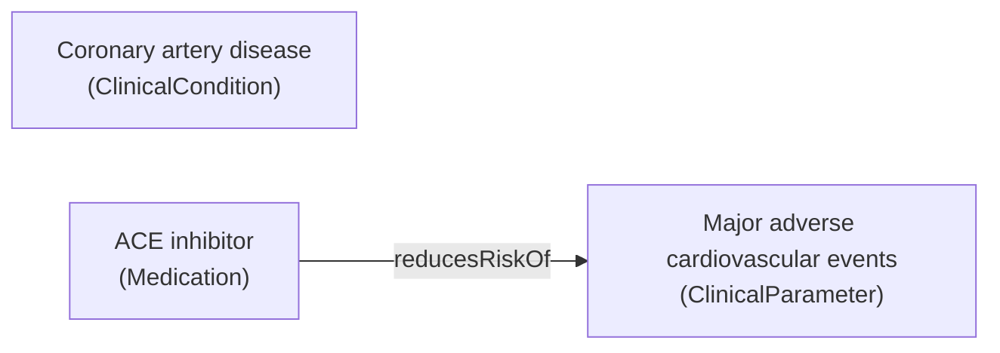
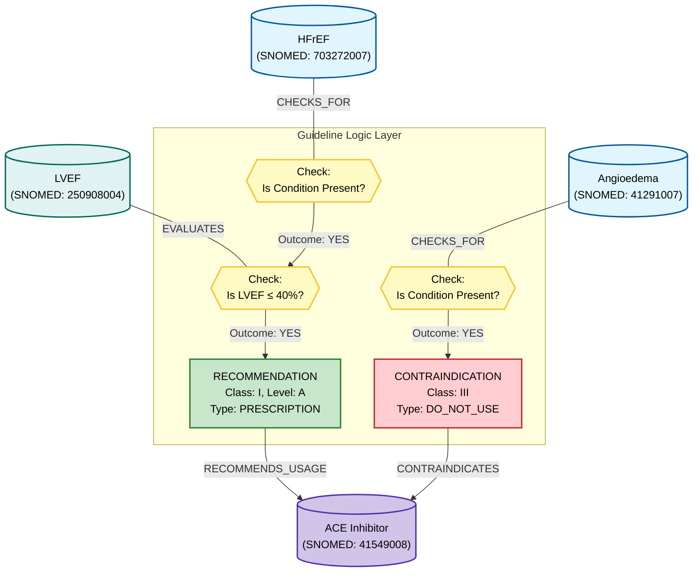
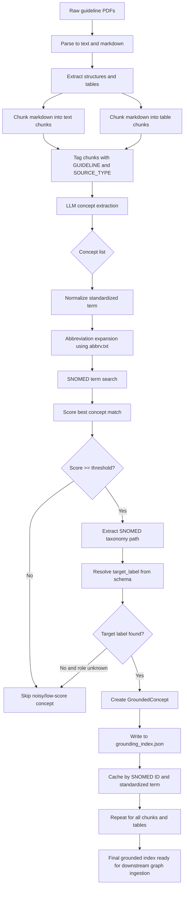

# Guideline parsing and grounding workflow

This folder contains the parsing, extraction, and grounding pipeline used to turn guideline documents into a SNOMED-backed concept index. The process is deterministic except for the LLM extraction step. This README documents the full workflow, intermediate artifacts, and how to run the pipeline end-to-end.

## Overview

**Goal:** Convert guideline PDFs/markdown into structured text chunks and tables, extract clinical concepts, ground them to SNOMED CT, and build a reusable JSON index.

**Primary outputs:**
- Grounding index: /prj/doctoral_letters/guide/data/grounding_index.json
- Timestamped snapshots: /prj/doctoral_letters/guide/data/grounding_index_YYYYMMDD_HHMMSS.json
- Extracted rules: /prj/doctoral_letters/guide/data/extracted_rules.jsonl
- Chunked guideline text: /prj/doctoral_letters/guide/data/guidelines/markdown/chunks
- Chunked tables: /prj/doctoral_letters/guide/data/guidelines/markdown/chunks/tables

**Why split grounding_index vs extracted_rules?**
- grounding_index.json is the stable SNOMED-backed dictionary for concepts (used across runs and for Neo4j concept nodes).
- extracted_rules.jsonl is the per-chunk, per-mention output that preserves logic and provenance (used to create decision/recommendation nodes and edges).
- This split keeps the reusable concept cache small and deterministic while allowing rule-level logic to evolve independently.

## Intermediate steps and files

1) **Collect guideline PDFs**
- Input: /prj/doctoral_letters/guide/data/guidelines/pdf

2) **Parse PDFs to text / markdown**
- Script: /home/pwiesenbach/CardioGuidelinesGraph/slurm/parse_guidelines_to_text.sh
- Output (examples):
  - /prj/doctoral_letters/guide/data/guidelines/text
  - /prj/doctoral_letters/guide/data/guidelines/markdown

3) **Extract tables and structures**
- Script: /home/pwiesenbach/CardioGuidelinesGraph/slurm/parse_markdown_tables_to_structures.sh
- Script: /home/pwiesenbach/CardioGuidelinesGraph/slurm/parse_structures_from_pdf.sh
- Output:
  - /prj/doctoral_letters/guide/data/guidelines/structures

4) **Chunk guideline markdown into manageable pieces**
- Module: markdown_chunks.py
- Output:
  - /prj/doctoral_letters/guide/data/guidelines/markdown/chunks
  - /prj/doctoral_letters/guide/data/guidelines/markdown/chunks/tables

5) **LLM concept extraction (tagged) + SNOMED grounding**
- Module: entity_grounding_service_new.py
- BAML prompt: /home/pwiesenbach/CardioGuidelinesGraph/src/cardio_graph/baml_src/extract_concepts.baml
- SNOMED schema mapping: /home/pwiesenbach/CardioGuidelinesGraph/src/cardio_graph/snomedct_utils/guideline_graph_schema.yaml
- Abbreviation expansion: /home/pwiesenbach/CardioGuidelinesGraph/src/cardio_graph/snomedct_utils/abbrv.txt

6) **Index creation and caching**
- Output index: /prj/doctoral_letters/guide/data/grounding_index.json
- Output rules (JSONL): /prj/doctoral_letters/guide/data/extracted_rules.jsonl
- The index is keyed by both SNOMED ID and normalized standardized term.
- Noisy lines are filtered prior to extraction, and low-score matches are skipped.

## Example: build the full grounding index

Use the SLURM wrapper:
- /home/pwiesenbach/CardioGuidelinesGraph/slurm/grounding_full_index.sh

Direct run (no SLURM):
- poetry run python /home/pwiesenbach/CardioGuidelinesGraph/src/cardio_graph/extraction_utils/entity_grounding_service_new.py \
  --chunks-dir /prj/doctoral_letters/guide/data/guidelines/markdown/chunks \
  --tables-dir /prj/doctoral_letters/guide/data/guidelines/markdown/chunks/tables \
  --guideline-title "2024 ESC Guidelines for the management of chronic coronary syndromes" \
  --model Qwen17b

Single-sentence example:
- poetry run python /home/pwiesenbach/CardioGuidelinesGraph/src/cardio_graph/extraction_utils/entity_grounding_service_new.py \
  --sentence "MACE was reduced with ACE-I in patients with CAD." \
  --guideline-title "2024 ESC Guidelines for the management of chronic coronary syndromes" \
  --model Qwen17b

## Detailed workflow description

1) **Parse guideline files**
- PDF and markdown are created from raw guideline sources. This step produces cleaned text, sections, and tables.

2) **Chunking**
- Long markdown is segmented into paragraph chunks and table chunks to keep LLM extraction stable and to track provenance.

3) **Tagged extraction**
- Each chunk is wrapped with tags:
  - [GUIDELINE: <title>]
  - [SOURCE_TYPE: text|table]
- The LLM (BAML) extracts:
  - `entity_original`
  - `entity_standardized_candidate`
  - `role` (Condition/Medication/Procedure/ClinicalParameter)
  - `logic` and `logic_structured`

4) **Abbreviation expansion**
- Terms are expanded using abbrv.txt (e.g., MACE ↔ major adverse cardiovascular events) during SNOMED search.

5) **SNOMED search and scoring**
- Candidate terms are searched in the SNOMED database.
- The best match is selected by normalized string similarity score.
- Matches below the threshold are skipped.

6) **Taxonomy path and target label**
- The SNOMED is-a path is traversed to a configured root.
- The path determines the `target_label` (ClinicalCondition, Medication, Procedure, ClinicalParameter).

7) **Index write-through**
- Results are saved to grounding_index.json (by SNOMED ID and standardized term).
- Extracted rules are saved to extracted_rules.jsonl (one rule per line, if present in the chunk).
- Subsequent runs reuse cached matches for speed and consistency.

## Upload into Neo4j (concepts + optional rules)

- Loader script: /home/pwiesenbach/CardioGuidelinesGraph/src/cardio_graph/neo4j_utils/grounding_index_to_neo4j.py
- SLURM wrapper: /home/pwiesenbach/CardioGuidelinesGraph/slurm/load_grounding_index_to_neo4j.sh

The loader ingests grounding_index.json as concept nodes, and if extracted_rules.jsonl is present it adds decision/recommendation nodes plus rule edges. By default it targets the Neo4j URI configured in feedneo4jdb.py.

## Example: one sentence to index entry

**Input sentence:**
- "MACE was reduced with ACE-I in patients with CAD."

**Step 1 — Tagged input passed to the LLM**
- [GUIDELINE: 2024 ESC Guidelines for the management of chronic coronary syndromes]
- [SOURCE_TYPE: text]
- MACE was reduced with ACE-I in patients with CAD.

**Step 2 — LLM extracts concepts**
- entity_original: "MACE"
  - entity_standardized_candidate: "major adverse cardiovascular events"
  - role: ClinicalParameter
- entity_original: "ACE-I"
  - entity_standardized_candidate: "angiotensin-converting enzyme inhibitor"
  - role: Medication
- entity_original: "CAD"
  - entity_standardized_candidate: "coronary artery disease"
  - role: Condition

**Step 3 — Abbreviation expansion and SNOMED search**
- "MACE" expands to "major adverse cardiovascular events" for SNOMED search.
- "ACE-I" expands to "angiotensin-converting enzyme inhibitor" for SNOMED search.
- "CAD" expands to "coronary artery disease" for SNOMED search.

**Step 4 — Example grounded entries written to the index (all three terms)**

- grounding_index.json (by standardized term):
  - entity_standardized_candidate: "major adverse cardiovascular events"
  - snomed_id: <resolved SNOMED concept id>
  - preferred_term: <SNOMED preferred term>
  - score: <similarity score>
  - taxonomy_path: [{"concept_id": "...", "term": "..."}, ...]
  - target_label: ClinicalParameter
  - role: ClinicalParameter

- grounding_index.json (by standardized term):
  - entity_standardized_candidate: "angiotensin-converting enzyme inhibitor"
  - snomed_id: <resolved SNOMED concept id>
  - preferred_term: <SNOMED preferred term>
  - score: <similarity score>
  - taxonomy_path: [{"concept_id": "...", "term": "..."}, ...]
  - target_label: Medication
  - role: Medication

- grounding_index.json (by standardized term):
  - entity_standardized_candidate: "coronary artery disease"
  - snomed_id: <resolved SNOMED concept id>
  - preferred_term: <SNOMED preferred term>
  - score: <similarity score>
  - taxonomy_path: [{"concept_id": "...", "term": "..."}, ...]
  - target_label: ClinicalCondition
  - role: Condition

**Impact summary for the three terms**

- MACE → standardized to "major adverse cardiovascular events" and grounded as a ClinicalParameter.
- ACE-I → standardized to "angiotensin-converting enzyme inhibitor" and grounded as a Medication.
- CAD → standardized to "coronary artery disease" and grounded as a ClinicalCondition.

**Mini graph (example triples)**

Below is a minimal graph that links grounded entities using only relations explicitly stated in the same chunk. In this sentence, the only relation supported by the text is the reduction of MACE with ACE-I.

- Asserted triple (within-chunk): (angiotensin-converting enzyme inhibitor) --reducesRiskOf--> (major adverse cardiovascular events)

**Mini graph (Mermaid view)**

## Example: complex recommendation + contraindication

**Input sentence:**
- "In patients with symptomatic HFrEF and LVEF ≤ 40%, an ACE-Inhibitor is recommended (Class I, Level A) to reduce mortality. However, in patients with a history of Angioedema, ACE-Inhibitors are contraindicated."

**Step 1 — Tagged input passed to the LLM**
- [GUIDELINE: 2024 ESC Guidelines for the management of chronic coronary syndromes]
- [SOURCE_TYPE: text]
- In patients with symptomatic HFrEF and LVEF ≤ 40%, an ACE-Inhibitor is recommended (Class I, Level A) to reduce mortality. However, in patients with a history of Angioedema, ACE-Inhibitors are contraindicated.

**Step 2 — LLM extracts concepts and logic**
- entity_original: "HFrEF"
  - entity_standardized_candidate: "heart failure with reduced ejection fraction"
  - role: Condition
- entity_original: "LVEF"
  - entity_standardized_candidate: "left ventricular ejection fraction"
  - role: ClinicalParameter
  - logic_structured: {"operator": "<=", "value": 40, "unit": "%"}
- entity_original: "ACE-Inhibitor"
  - entity_standardized_candidate: "angiotensin-converting enzyme inhibitor"
  - role: Medication
- entity_original: "Angioedema"
  - entity_standardized_candidate: "angioedema"
  - role: Condition
- rule_id: <unique rule id>
  - logic: "HFrEF AND LVEF <= 40% => recommend ACE-Inhibitor (Class I, Level A)"
  - logic_structured: {"type": "RECOMMENDATION", "class": "I", "level": "A"}
- rule_id: <unique rule id>
  - logic: "History of angioedema => contraindicate ACE-Inhibitor"
  - logic_structured: {"type": "CONTRAINDICATION", "class": "III"}

**Step 3 — Abbreviation expansion and SNOMED search**
- "HFrEF" expands to "heart failure with reduced ejection fraction" for SNOMED search.
- "LVEF" expands to "left ventricular ejection fraction" for SNOMED search.
- "ACE-Inhibitor" expands to "angiotensin-converting enzyme inhibitor" for SNOMED search.
- "Angioedema" is searched directly for SNOMED grounding.

**Step 4 — Outputs written**
- grounding_index.json (concepts grounded as usual)
- extracted_rules.jsonl (rules emitted with references to grounded concepts)

**Mermaid graph (logic + semantics)**

## Mermaid flow chart (full workflow)

## Notes and key configuration

- SNOMED mapping rules: /home/pwiesenbach/CardioGuidelinesGraph/src/cardio_graph/snomedct_utils/guideline_graph_schema.yaml
- Abbreviation list: /home/pwiesenbach/CardioGuidelinesGraph/src/cardio_graph/snomedct_utils/abbrv.txt
- LLM model aliases: /home/pwiesenbach/CardioGuidelinesGraph/src/cardio_graph/extraction_utils/clients.py
- Grounding service: /home/pwiesenbach/CardioGuidelinesGraph/src/cardio_graph/extraction_utils/entity_grounding_service_new.py
