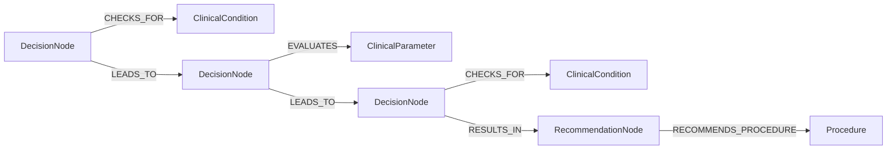
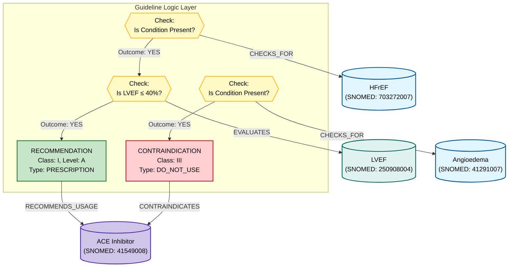
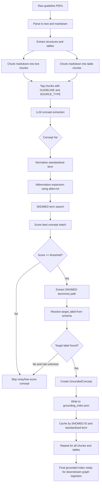

## Graph builder: row-level extraction to Neo4j

The main script is:
- /home/pwiesenbach/CardioGuidelinesGraph/src/cardio_graph/extraction_utils/guideline_graph_builder.py

This script takes a single row (or full table), runs multi-pass BAML extraction, grounds concepts, and writes two outputs:
- grounding_index_*.json (concept cache)
- extracted_rules_*.jsonl (logic-preserving rule entries)

### Multi-pass extraction (row-level)

Each table row is formatted as a tagged block:
- [GUIDELINE: <title>]
- [SOURCE_TYPE: table]
- [FOCUS: <pass>]

We run two passes on the same row text:
1) MAIN: full rule extraction (conditions/parameters + actions)
2) POPULATION: population/cohort conditions only (no actions)

The two passes are merged and deduplicated before OR-splitting. This avoids hardcoding while improving recall for population clauses like "In chronic coronary syndrome patients...".

### Expected output structure (JSON)

The tests compare row_10 against a structure-only reference (grounding ignored). The expected JSON lives at:
- /home/pwiesenbach/CardioGuidelinesGraph/tests/expected_row_10_structure.json

Shape (structure-only):

```json
{
  "row_id": "row_10",
  "class": "I",
  "level": "A",
  "recommendation_text": "...",
  "rules": [
    {
      "rule_id": 1,
      "conditions": [
        {
          "entity_original": "CCS",
          "entity_standardized_candidate": "chronic coronary syndrome",
          "role": "Condition",
          "logic_structured": {
            "operator": "PRESENT",
            "threshold": null,
            "unit": null,
            "condition_context": null,
            "logic_type": "AND",
            "logic_group": "and_1"
          }
        }
      ],
      "actions": [
        {
          "entity_original": "myocardial revascularization",
          "entity_standardized_candidate": "myocardial revascularization",
          "role": "Procedure",
          "logic_structured": {
            "strength": "I",
            "level": "A",
            "direction": "POSITIVE"
          }
        }
      ]
    }
  ]
}
```

### How rules map into Neo4j

The loader uses extracted_rules.jsonl to build rule logic. The intended graph structure is:



Notes:
- Conditions use CHECKS_FOR; clinical parameters use EVALUATES.
- AND logic is represented via LEADS_TO chains.

### Running a single row extraction

The SLURM wrapper for table_000 is intentionally untracked. Run it locally or submit via SLURM in your environment:

```bash
poetry run python /home/pwiesenbach/CardioGuidelinesGraph/src/cardio_graph/extraction_utils/guideline_graph_builder.py \
  --docling-table-json /prj/doctoral_letters/guide/data/guidelines/docling/pdf_pages/_62/tables/table_000.json \
  --docling-table-json /prj/doctoral_letters/guide/data/guidelines/docling/pdf_pages/_63/tables/table_000.json \
  --docling-table-id _62_63/table_000.json \
  --docling-footnotes-path /tmp/docling_table_footnotes.txt \
  --min-match-score 0.6 \
  --guideline-title "2024 ESC Guidelines for the management of chronic coronary syndromes" \
  --index-path /prj/doctoral_letters/guide/data/grounding_index_docling_table_000.json \
  --rules-out-path /prj/doctoral_letters/guide/data/extracted_rules_docling_table_000.jsonl \
  --node g5 \
  --model Qwen30b
```
- [SOURCE_TYPE: text]
- In patients with symptomatic HFrEF and LVEF ≤ 40%, an ACE-Inhibitor is recommended (Class I, Level A) to reduce mortality. However, in patients with a history of Angioedema, ACE-Inhibitors are contraindicated.

**Step 2 — LLM extracts concepts and logic**
- entity_original: "HFrEF"
  - entity_standardized_candidate: "heart failure with reduced ejection fraction"
  - role: Condition
- entity_original: "LVEF"
  - entity_standardized_candidate: "left ventricular ejection fraction"
  - role: ClinicalParameter
  - logic_structured: {"operator": "<=", "value": 40, "unit": "%"}
- entity_original: "ACE-Inhibitor"
  - entity_standardized_candidate: "angiotensin-converting enzyme inhibitor"
  - role: Medication
- entity_original: "Angioedema"
  - entity_standardized_candidate: "angioedema"
  - role: Condition
- rule_id: <unique rule id>
  - logic: "HFrEF AND LVEF <= 40% => recommend ACE-Inhibitor (Class I, Level A)"
  - logic_structured: {"type": "RECOMMENDATION", "class": "I", "level": "A"}
- rule_id: <unique rule id>
  - logic: "History of angioedema => contraindicate ACE-Inhibitor"
  - logic_structured: {"type": "CONTRAINDICATION", "class": "III"}

**Step 3 — Abbreviation expansion and SNOMED search**
- "HFrEF" expands to "heart failure with reduced ejection fraction" for SNOMED search.
- "LVEF" expands to "left ventricular ejection fraction" for SNOMED search.
- "ACE-Inhibitor" expands to "angiotensin-converting enzyme inhibitor" for SNOMED search.
- "Angioedema" is searched directly for SNOMED grounding.

**Step 4 — Outputs written**
- grounding_index.json (concepts grounded as usual)
- extracted_rules.jsonl (rules emitted with references to grounded concepts)

**Mermaid graph (logic + semantics)**



## Mermaid flow chart (full workflow)



## Notes and key configuration

- SNOMED mapping rules: /home/pwiesenbach/CardioGuidelinesGraph/src/cardio_graph/snomedct_utils/guideline_graph_schema.yaml
- Abbreviation list: /home/pwiesenbach/CardioGuidelinesGraph/src/cardio_graph/snomedct_utils/abbrv.txt
- LLM model aliases: /home/pwiesenbach/CardioGuidelinesGraph/src/cardio_graph/extraction_utils/clients.py
- Grounding service: /home/pwiesenbach/CardioGuidelinesGraph/src/cardio_graph/extraction_utils/entity_grounding_service_new.py
