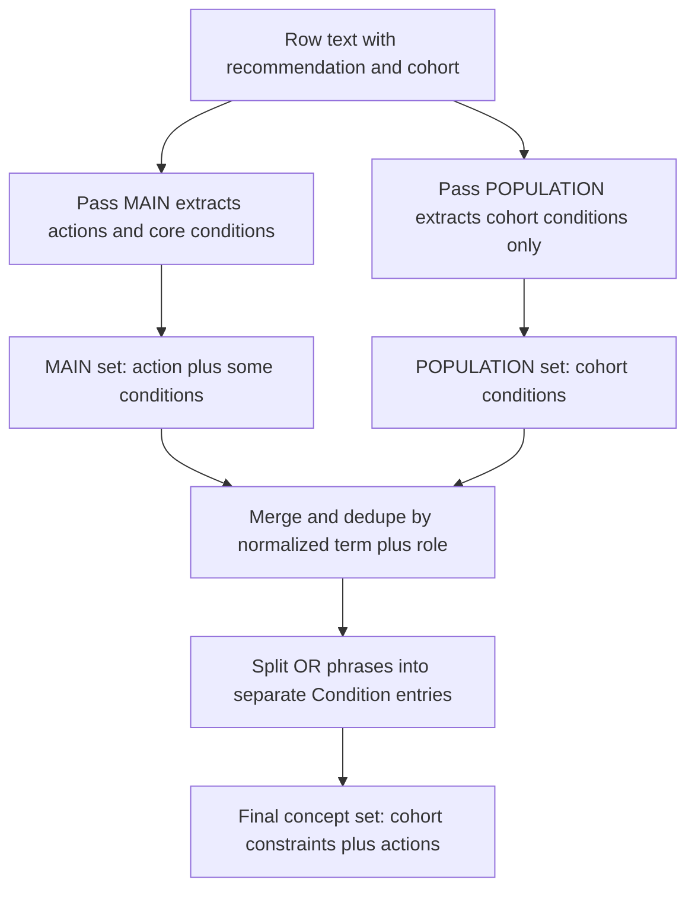
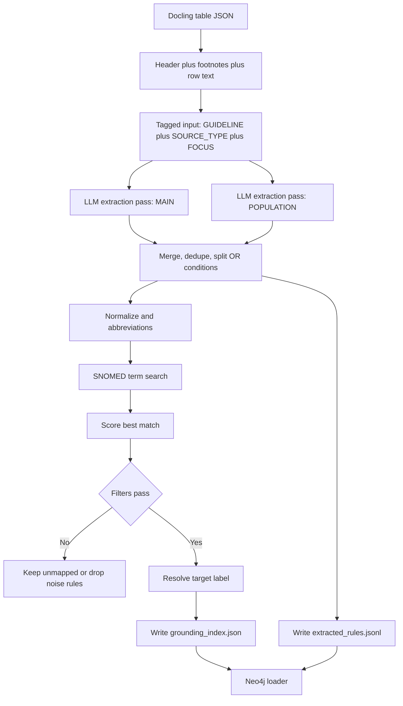

## Graph builder: docling table to Neo4j

Main entrypoint:

- /home/pwiesenbach/CardioGuidelinesGraph/src/cardio_graph/extraction_utils/guideline_graph_builder.py

Pipeline summary (sentence + header + footnotes -> LLM x2 -> JSON -> Neo4j):

1) **Input assembly**
   - Docling table rows are formatted with header and optional footnotes.
   - A table row or the entire table is tagged with:
     - GUIDELINE: title
     - SOURCE_TYPE: table
     - FOCUS: pass

2) **LLM extraction (two passes)**
   - MAIN: conditions/parameters + actions.
   - POPULATION: cohort and population conditions only.
   - Results are merged and deduplicated, then OR conditions are split.

Example (two-pass extraction and merge):

Input (row text):
"In chronic coronary syndrome patients with LVEF <= 35% who are high surgical risk or not operable, PCI may be considered (Class IIb, Level B)."

MAIN pass output (actions + conditions):
- entity_original: "chronic coronary syndrome patients"
  entity_standardized_candidate: "chronic coronary syndrome patients"
  role: Condition
- entity_original: "LVEF <= 35%"
  entity_standardized_candidate: "left ventricular ejection fraction <= 35%"
  role: ClinicalParameter
  logic_structured: {"operator": "<=", "threshold": "35", "unit": "%"}
- entity_original: "high surgical risk"
  entity_standardized_candidate: "high surgical risk"
  role: Condition
- entity_original: "not operable"
  entity_standardized_candidate: "not operable"
  role: Condition
- entity_original: "PCI"
  entity_standardized_candidate: "percutaneous coronary intervention"
  role: Procedure
  logic_structured: {"strength": "Class IIb", "level": "B", "direction": "POSITIVE"}

POPULATION pass output (population conditions only):
- entity_original: "chronic coronary syndrome patients"
  entity_standardized_candidate: "chronic coronary syndrome patients"
  role: Condition
- entity_original: "LVEF <= 35%"
  entity_standardized_candidate: "left ventricular ejection fraction <= 35%"
  role: ClinicalParameter
  logic_structured: {"operator": "<=", "threshold": "35", "unit": "%"}

Merge result (dedupe + OR-split):
- Keep one copy of shared population conditions from both passes.
- Keep action from MAIN (PCI).
- If the row contains "high surgical risk or not operable", split into two
  Condition concepts with OR logic group (same rule_id).



3) **Grounding + filtering**
   - Abbreviations are expanded (see abbrv.txt).
   - SNOMED concepts are retrieved by term search.
   - Best match is scored and optionally filtered by:
     - `--min-match-score` (default 0.7)
     - `--domain-filter` (root concept gating by role)
     - `--semantic-tag-filter` (FSN tag allowlist)
     - `--off-domain-min-score` (fallback to off-domain only if high score)

4) **Outputs**
   - `grounding_index_*.json` (SNOMED cache by ID)
   - `extracted_rules_*.jsonl` (rule logic with links to grounded concepts)

5) **Neo4j loading**
   - Load index and rules into Neo4j:
     - /home/pwiesenbach/CardioGuidelinesGraph/src/cardio_graph/neo4j_utils/grounding_index_to_neo4j.py

### LLM tagging format

Each input is tagged before calling BAML:

- GUIDELINE: title
- SOURCE_TYPE: table
- FOCUS: MAIN
  (or POPULATION)

### Grounding filters and scoring

**Scoring**
- The best candidate is selected by a composite similarity score.
- `--min-match-score` drops low-confidence mappings.

Example (scoring):

```
Input term: "SYNTAX score"
Candidate A: "Leukocyte alkaline phosphatase score (procedure)" -> score 0.72
Candidate B: "SYNTAX score (procedure)" -> score 0.93
Result: Candidate B wins; if `--min-match-score 0.9`, Candidate B is kept.
```

**Domain filter**
- `--domain-filter` keeps candidates whose taxonomy path intersects the
  allowed root concepts for the role (from guideline_graph_schema.yaml).

Example (domain filter):

```
Role: ClinicalParameter
Allowed roots: Observable entity
Candidate term: "Determination of ventricular ejection fraction (procedure)"
Taxonomy path: ... -> Procedure
Result: Filtered out because no Observable entity in the path.
```

**Semantic tag allowlist**
- `--semantic-tag-filter` checks the SNOMED FSN tag:
  - Condition -> disorder, finding
  - ClinicalParameter -> observable entity
  - Medication -> substance, product
  - Procedure -> procedure

**Off-domain fallback**
- `--off-domain-min-score 0.9` allows off-domain candidates only when
  they are exceptionally high-scoring.

### Outputs (JSON)

`grounding_index_*.json` entries contain:

```json
{
  "entity_standardized_candidate": "left ventricular ejection fraction <= 35%",
  "snomed_id": 250908004,
  "preferred_term": "Left ventricular ejection fraction (observable entity)",
  "score": 0.91,
  "taxonomy_path": [{"concept_id": "250908004", "term": "..."}],
  "target_label": "ClinicalParameter"
}
```

`extracted_rules_*.jsonl` entries contain the rule logic and references to
the grounded concept IDs so the Neo4j loader can build the decision logic.

### Neo4j mapping

The loader reads the JSON index and rules and builds:

- Concept nodes (by `snomed_id`, labeled by `target_label`)
- Decision nodes and recommendation nodes
- Edges:
  - CHECKS_FOR (conditions)
  - EVALUATES (clinical parameters)
  - LEADS_TO (AND logic)
  - RESULTS_IN (decision to recommendation)
  - RECOMMENDS_PROCEDURE / RECOMMENDS_MEDICATION

### Example: row-wise extraction (docling)

```bash
poetry run python /home/pwiesenbach/CardioGuidelinesGraph/src/cardio_graph/extraction_utils/guideline_graph_builder.py \
  --docling-table-json /prj/doctoral_letters/guide/data/guidelines/docling/pdf_pages/_62/tables/table_000.json \
  --docling-table-json /prj/doctoral_letters/guide/data/guidelines/docling/pdf_pages/_63/tables/table_000.json \
  --docling-table-id _62_63/table_000.json \
  --docling-footnotes-path /tmp/docling_table_footnotes.txt \
  --min-match-score 0.6 \
  --domain-filter \
  --semantic-tag-filter \
  --off-domain-min-score 0.9 \
  --guideline-title "2024 ESC Guidelines for the management of chronic coronary syndromes" \
  --index-path /prj/doctoral_letters/guide/data/graph/grounding_index_docling_table_000.json \
  --rules-out-path /prj/doctoral_letters/guide/data/graph/extracted_rules_docling_table_000.jsonl \
  --node g5 \
  --model Qwen30b
```

### Mermaid flow chart (full pipeline)



### Key configuration

- SNOMED mapping rules: /home/pwiesenbach/CardioGuidelinesGraph/src/cardio_graph/snomedct_utils/guideline_graph_schema.yaml
- Abbreviations: /home/pwiesenbach/CardioGuidelinesGraph/src/cardio_graph/snomedct_utils/abbrv.txt
- LLM model registry: /home/pwiesenbach/CardioGuidelinesGraph/src/cardio_graph/extraction_utils/clients.py
- SNOMED query implementation: /home/pwiesenbach/CardioGuidelinesGraph/src/cardio_graph/snomedct_utils/snomed_query.py
- Neo4j loader: /home/pwiesenbach/CardioGuidelinesGraph/src/cardio_graph/neo4j_utils/grounding_index_to_neo4j.py
