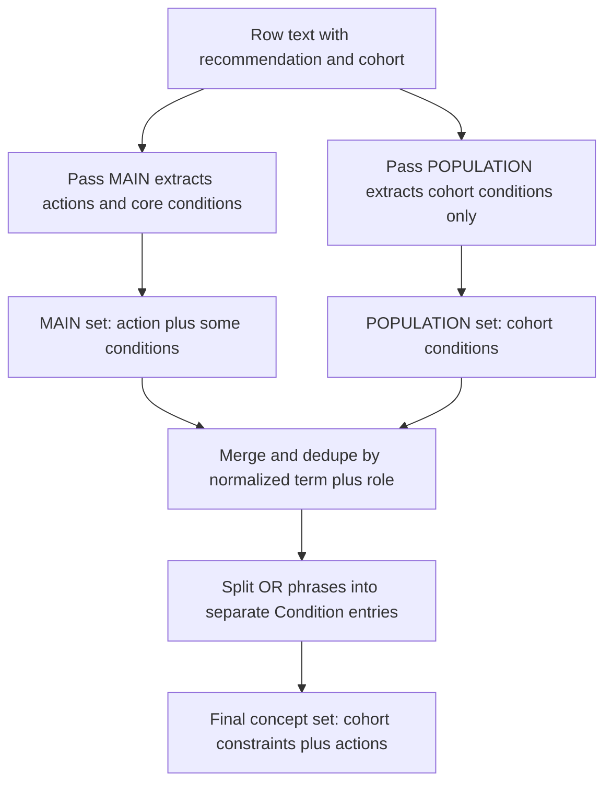
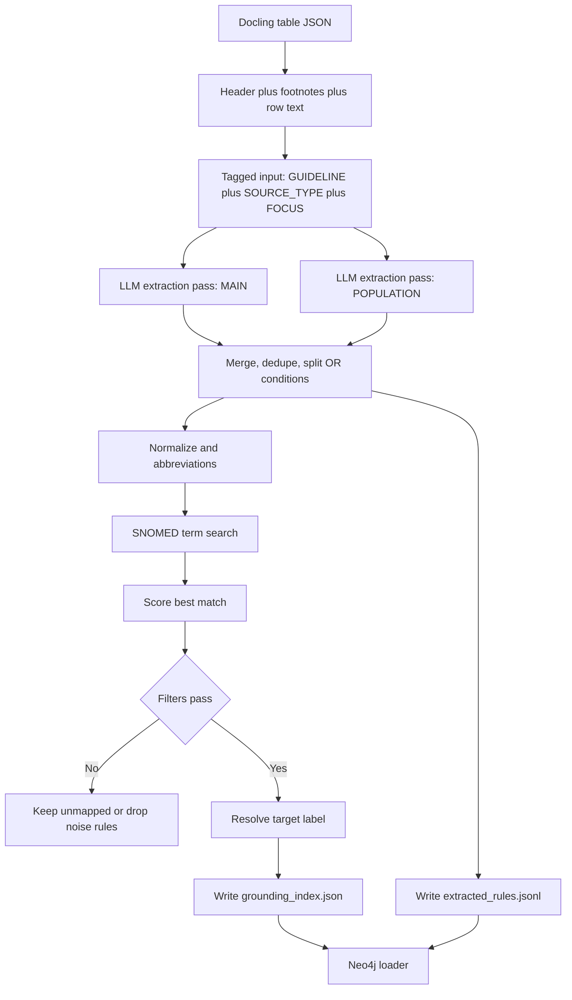

# Tests

This folder restores the core, row-level tests for the graph pipeline.

## What is covered

- Row 10 structure extraction (active).
- Row 10 grounding (skipped until curated ground truth exists).
- Row 10 Neo4j representation (active, requires a running Neo4j).

## How the tests find data

All tests avoid absolute paths. Point them to your local data with env vars:

- CARDIO_GRAPH_DATA_DIR: base data directory (default: data/)
- CARDIO_GRAPH_GUIDELINES_DIR: guidelines directory (default: data/guidelines/)
- CARDIO_GRAPH_GRAPH_DIR: graph outputs directory (default: data/graph/)
- CARDIO_GRAPH_EXPECTED_ROW10_PATH: expected structure JSON
- CARDIO_GRAPH_RULES_ROW10_PATH: extracted rules JSONL for row 10
- CARDIO_GRAPH_ROW10_HUMAN_READABLE_PATH: human readable row 10 JSON
- CARDIO_GRAPH_ROW10_GROUND_TRUTH_PATH: curated grounding truth JSON (enables grounding test)
- CARDIO_GRAPH_NEO4J_URI, CARDIO_GRAPH_NEO4J_USER, CARDIO_GRAPH_NEO4J_PASSWORD

## Running tests

```bash
poetry run python -m unittest tests.test_row_10_structure_extraction
poetry run python -m unittest tests.test_row_10_structure_rules
poetry run python -m unittest tests.test_row_10_graph
```

Grounding test (skips without a ground truth file):

```bash
export CARDIO_GRAPH_ROW10_GROUND_TRUTH_PATH=path/to/row10_ground_truth.json
poetry run python -m unittest tests.test_row_10_grounding
```

## What the tests validate

### Two-pass extraction and merge



### Full pipeline flowchart



### Expected structure JSON (row 10)

```json
{
  "row_id": "row_10",
  "class": "I",
  "level": "A",
  "recommendation_text": "In chronic coronary syndrome (CCS) patients with left ventricular ejection fraction (LVEF) > 35%, myocardial revascularization is recommended, in addition to guideline-directed medical therapy, for patients with functionally significant three-vessel disease to improve long-term survival and to reduce long-term cardiovascular mortality and the risk of spontaneous myocardial infarction.",
  "rules": [
    {
      "rule_id": 1,
      "conditions": [
        {
          "entity_original": "CCS",
          "entity_standardized_candidate": "chronic coronary syndrome",
          "role": "Condition",
          "logic_structured": {
            "operator": "PRESENT",
            "threshold": null,
            "unit": null,
            "condition_context": null,
            "logic_type": "AND",
            "logic_group": "and_1"
          }
        }
      ],
      "actions": [
        {
          "entity_original": "myocardial revascularization",
          "entity_standardized_candidate": "myocardial revascularization",
          "role": "Procedure",
          "logic_structured": {
            "strength": "I",
            "level": "A",
            "direction": "POSITIVE"
          }
        }
      ]
    }
  ]
}
```

### Grounding index entry example

```json
{
  "entity_standardized_candidate": "left ventricular ejection fraction <= 35%",
  "snomed_id": 250908004,
  "preferred_term": "Left ventricular ejection fraction (observable entity)",
  "score": 0.91,
  "taxonomy_path": [{"concept_id": "250908004", "term": "..."}],
  "target_label": "ClinicalParameter"
}
```

### Extracted rules entry example

```json
{
  "rule_id": 1,
  "role": "Condition",
  "entity_original": "LVEF > 35%",
  "entity_standardized_candidate": "left ventricular ejection fraction",
  "logic_structured": {
    "operator": ">",
    "threshold": "35",
    "unit": "%",
    "logic_type": "AND",
    "logic_group": "and_1"
  }
}
```

## Notes

- The grounding test compares curated mappings to the extracted rules output.
- The Neo4j test validates decision nodes, chain structure, and action links.
- More row and table-level tests will be added as ground truth is finalized.
